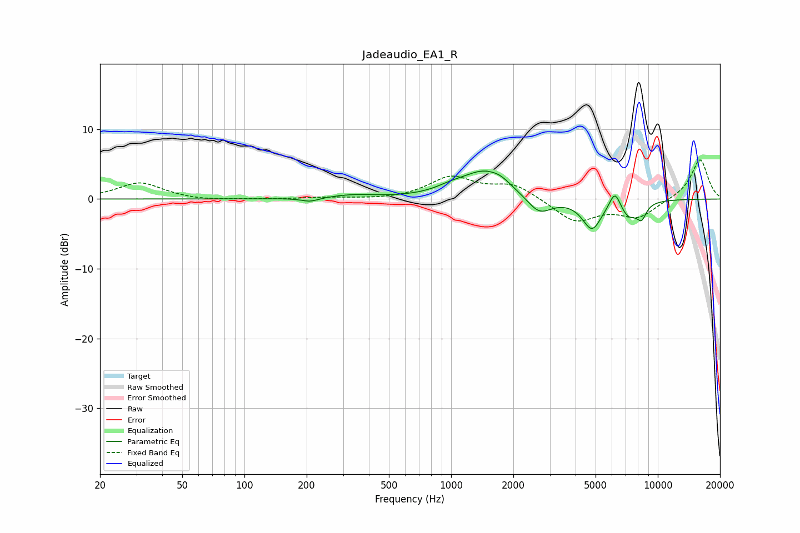

# Jadeaudio_EA1_R
See [usage instructions](https://github.com/jaakkopasanen/AutoEq#usage) for more options and info.

### Parametric EQs
Apply preamp of -4.1 dB when using parametric equalizer.

|   # | Type    |   Fc (Hz) |    Q |   Gain (dB) |
|-----|---------|-----------|------|-------------|
|   1 | Peaking |       208 | 3.34 |        -0.5 |
|   2 | Peaking |       332 | 1.27 |         0.5 |
|   3 | Peaking |       995 | 1.91 |         0.7 |
|   4 | Peaking |      1463 | 1.25 |         3.9 |
|   5 | Peaking |      1752 | 3.44 |         0.5 |
|   6 | Peaking |      2669 | 2.34 |        -2.5 |
|   7 | Peaking |      4807 | 2.97 |        -4.2 |
|   8 | Peaking |      6206 | 5.07 |         2.7 |
|   9 | Peaking |      7235 | 2.96 |        -2.3 |
|  10 | Peaking |      8352 | 5.79 |        -2   |

### Fixed Band EQs
When using fixed band (also called graphic) equalizer, apply preamp of **-5.7 dB** (if available) and set gains manually with these parameters.

|   # | Type    |   Fc (Hz) |    Q |   Gain (dB) |
|-----|---------|-----------|------|-------------|
|   1 | Peaking |        31 | 1.41 |         2.4 |
|   2 | Peaking |        62 | 1.41 |        -0.3 |
|   3 | Peaking |       125 | 1.41 |        -0   |
|   4 | Peaking |       250 | 1.41 |         0.2 |
|   5 | Peaking |       500 | 1.41 |        -0.1 |
|   6 | Peaking |      1000 | 1.41 |         3   |
|   7 | Peaking |      2000 | 1.41 |         2.1 |
|   8 | Peaking |      4000 | 1.41 |        -3.3 |
|   9 | Peaking |      8000 | 1.41 |        -2.5 |
|  10 | Peaking |     16000 | 1.41 |         5.8 |

### Graphs

