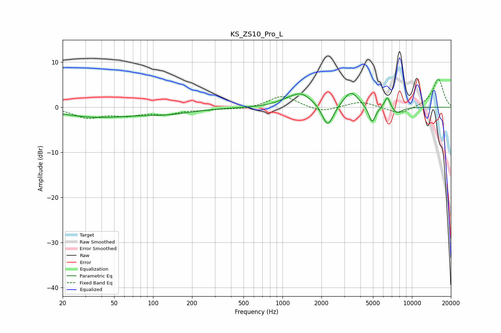

# KS_ZS10_Pro_L
See [usage instructions](https://github.com/jaakkopasanen/AutoEq#usage) for more options and info.

### Parametric EQs
Apply preamp of -3.2 dB when using parametric equalizer.

|   # | Type    |   Fc (Hz) |    Q |   Gain (dB) |
|-----|---------|-----------|------|-------------|
|   1 | Peaking |        36 | 0.52 |        -2.1 |
|   2 | Peaking |       130 | 0.69 |        -1.2 |
|   3 | Peaking |      1033 | 1.99 |         0.5 |
|   4 | Peaking |      1389 | 1.65 |         3   |
|   5 | Peaking |      2215 | 3.6  |        -4.3 |
|   6 | Peaking |      2381 | 3.29 |        -0.9 |
|   7 | Peaking |      3377 | 2.43 |         3.5 |
|   8 | Peaking |      4927 | 5.24 |        -3.8 |
|   9 | Peaking |      6469 | 5.91 |         2.8 |
|  10 | Peaking |      7587 | 3.02 |        -1.5 |

### Fixed Band EQs
When using fixed band (also called graphic) equalizer, apply preamp of **-6.3 dB** (if available) and set gains manually with these parameters.

|   # | Type    |   Fc (Hz) |    Q |   Gain (dB) |
|-----|---------|-----------|------|-------------|
|   1 | Peaking |        31 | 1.41 |        -2.2 |
|   2 | Peaking |        62 | 1.41 |        -1.5 |
|   3 | Peaking |       125 | 1.41 |        -1.3 |
|   4 | Peaking |       250 | 1.41 |        -0.4 |
|   5 | Peaking |       500 | 1.41 |        -0.5 |
|   6 | Peaking |      1000 | 1.41 |         2.6 |
|   7 | Peaking |      2000 | 1.41 |        -1.2 |
|   8 | Peaking |      4000 | 1.41 |         1.3 |
|   9 | Peaking |      8000 | 1.41 |        -1.6 |
|  10 | Peaking |     16000 | 1.41 |         6.3 |

### Graphs

