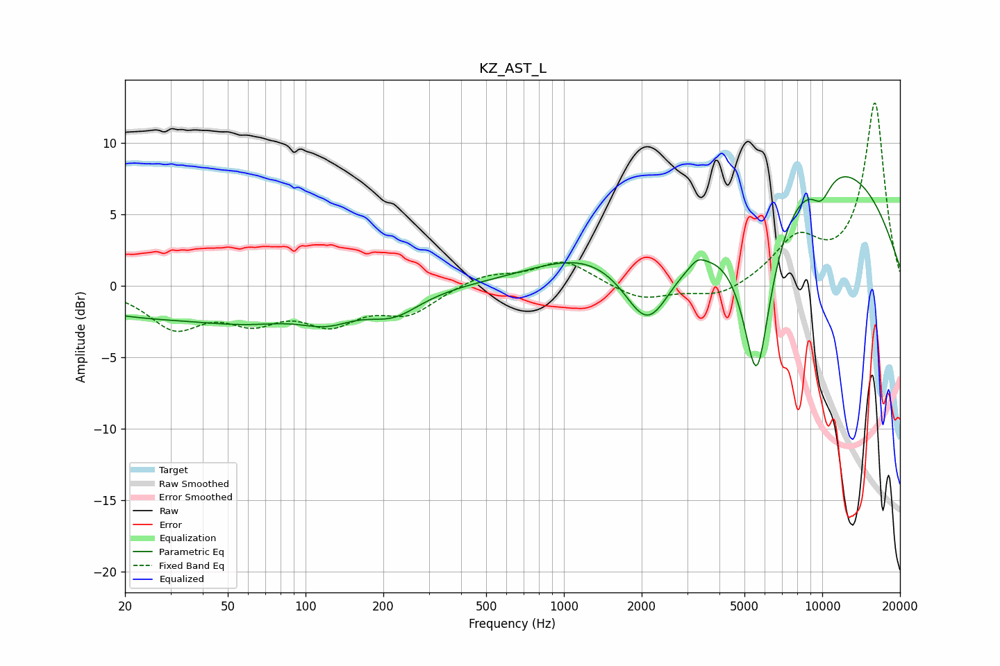

# KZ_AST_L
See [usage instructions](https://github.com/jaakkopasanen/AutoEq#usage) for more options and info.

### Parametric EQs
Apply preamp of -7.7 dB when using parametric equalizer.

|   # | Type    |   Fc (Hz) |    Q |   Gain (dB) |
|-----|---------|-----------|------|-------------|
|   1 | Peaking |        23 | 0.45 |        -1.8 |
|   2 | Peaking |        62 | 0.72 |        -1.4 |
|   3 | Peaking |       121 | 1.28 |        -1.5 |
|   4 | Peaking |       219 | 1.34 |        -1.6 |
|   5 | Peaking |      1231 | 0.66 |         2   |
|   6 | Peaking |      2110 | 1.53 |        -5.1 |
|   7 | Peaking |      3289 | 5.13 |         0.5 |
|   8 | Peaking |      5577 | 2.35 |       -12.3 |
|   9 | Peaking |      9913 | 3.1  |        -1.8 |
|  10 | Peaking |     10000 | 0.32 |         8.9 |

### Fixed Band EQs
When using fixed band (also called graphic) equalizer, apply preamp of **-12.9 dB** (if available) and set gains manually with these parameters.

|   # | Type    |   Fc (Hz) |    Q |   Gain (dB) |
|-----|---------|-----------|------|-------------|
|   1 | Peaking |        31 | 1.41 |        -2.7 |
|   2 | Peaking |        62 | 1.41 |        -2   |
|   3 | Peaking |       125 | 1.41 |        -2.3 |
|   4 | Peaking |       250 | 1.41 |        -1.8 |
|   5 | Peaking |       500 | 1.41 |         0.8 |
|   6 | Peaking |      1000 | 1.41 |         1.8 |
|   7 | Peaking |      2000 | 1.41 |        -1.1 |
|   8 | Peaking |      4000 | 1.41 |        -0.9 |
|   9 | Peaking |      8000 | 1.41 |         3   |
|  10 | Peaking |     16000 | 1.41 |        12.7 |

### Graphs

