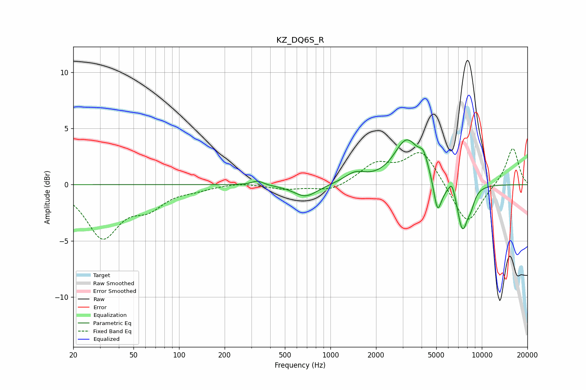

# KZ_DQ6S_R
See [usage instructions](https://github.com/jaakkopasanen/AutoEq#usage) for more options and info.

### Parametric EQs
Apply preamp of -4.1 dB when using parametric equalizer.

|   # | Type    |   Fc (Hz) |    Q |   Gain (dB) |
|-----|---------|-----------|------|-------------|
|   1 | Peaking |       330 | 3.72 |         0.4 |
|   2 | Peaking |       686 | 1.78 |        -1.1 |
|   3 | Peaking |      1455 | 2.02 |         0.9 |
|   4 | Peaking |      3196 | 1.68 |         3.9 |
|   5 | Peaking |      4121 | 4.72 |         1.4 |
|   6 | Peaking |      5083 | 5.88 |        -2.5 |
|   7 | Peaking |      5414 | 4.01 |        -0.6 |
|   8 | Peaking |      6365 | 6    |         1.2 |
|   9 | Peaking |      7450 | 3.67 |        -4.1 |
|  10 | Peaking |      8479 | 5.34 |        -1   |

### Fixed Band EQs
When using fixed band (also called graphic) equalizer, apply preamp of **-3.3 dB** (if available) and set gains manually with these parameters.

|   # | Type    |   Fc (Hz) |    Q |   Gain (dB) |
|-----|---------|-----------|------|-------------|
|   1 | Peaking |        31 | 1.41 |        -4.5 |
|   2 | Peaking |        62 | 1.41 |        -1.7 |
|   3 | Peaking |       125 | 1.41 |        -0.3 |
|   4 | Peaking |       250 | 1.41 |         0.2 |
|   5 | Peaking |       500 | 1.41 |        -0.4 |
|   6 | Peaking |      1000 | 1.41 |        -0.6 |
|   7 | Peaking |      2000 | 1.41 |         1.7 |
|   8 | Peaking |      4000 | 1.41 |         3   |
|   9 | Peaking |      8000 | 1.41 |        -3.7 |
|  10 | Peaking |     16000 | 1.41 |         3.4 |

### Graphs

