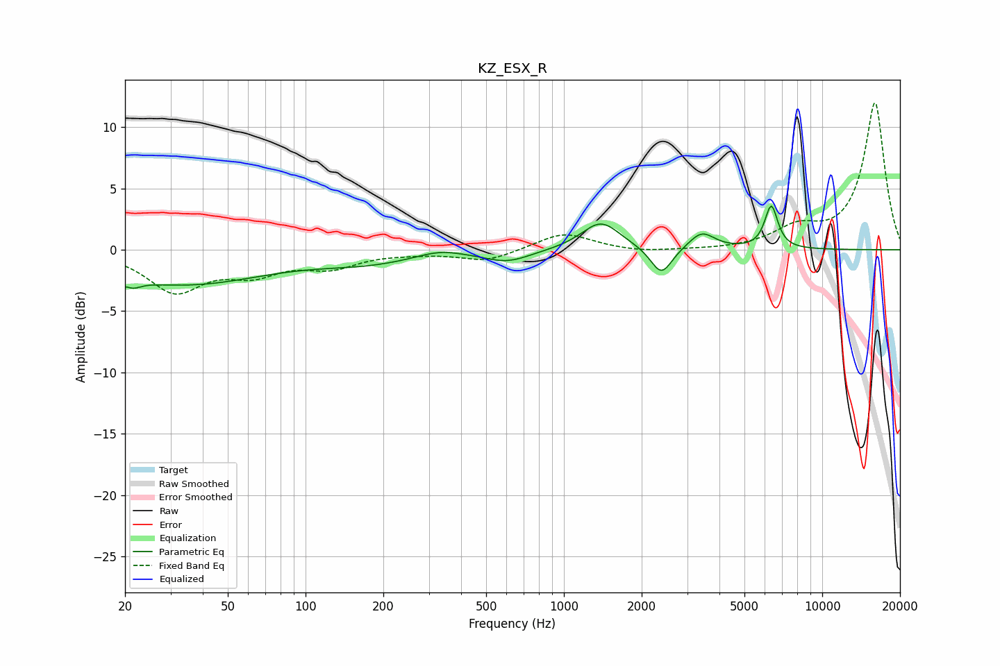

# KZ_ESX_R
See [usage instructions](https://github.com/jaakkopasanen/AutoEq#usage) for more options and info.

### Parametric EQs
Apply preamp of -3.7 dB when using parametric equalizer.

|   # | Type    |   Fc (Hz) |    Q |   Gain (dB) |
|-----|---------|-----------|------|-------------|
|   1 | Peaking |        20 | 4.81 |        -3   |
|   2 | Peaking |        20 | 6    |         2.3 |
|   3 | Peaking |        34 | 0.45 |        -2.8 |
|   4 | Peaking |       174 | 0.71 |        -0.9 |
|   5 | Peaking |       330 | 1.69 |         0.5 |
|   6 | Peaking |       603 | 1.57 |        -0.9 |
|   7 | Peaking |      1390 | 1.9  |         2.3 |
|   8 | Peaking |      2385 | 3.4  |        -2.3 |
|   9 | Peaking |      3417 | 2.83 |         1.4 |
|  10 | Peaking |      6350 | 5.47 |         3.5 |

### Fixed Band EQs
When using fixed band (also called graphic) equalizer, apply preamp of **-12.1 dB** (if available) and set gains manually with these parameters.

|   # | Type    |   Fc (Hz) |    Q |   Gain (dB) |
|-----|---------|-----------|------|-------------|
|   1 | Peaking |        31 | 1.41 |        -3.3 |
|   2 | Peaking |        62 | 1.41 |        -1.6 |
|   3 | Peaking |       125 | 1.41 |        -1.3 |
|   4 | Peaking |       250 | 1.41 |        -0.2 |
|   5 | Peaking |       500 | 1.41 |        -0.9 |
|   6 | Peaking |      1000 | 1.41 |         1.4 |
|   7 | Peaking |      2000 | 1.41 |        -0.2 |
|   8 | Peaking |      4000 | 1.41 |        -0.1 |
|   9 | Peaking |      8000 | 1.41 |         1.6 |
|  10 | Peaking |     16000 | 1.41 |        12   |

### Graphs

