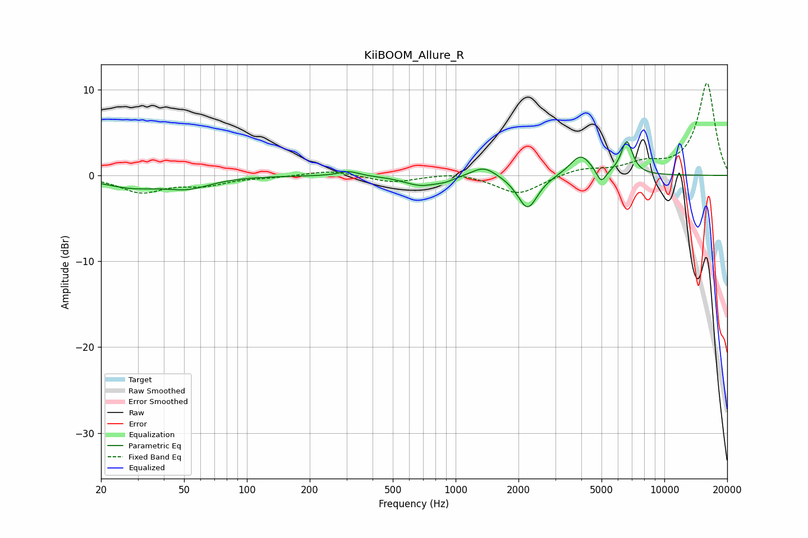

# KiiBOOM_Allure_R
See [usage instructions](https://github.com/jaakkopasanen/AutoEq#usage) for more options and info.

### Parametric EQs
Apply preamp of -4.0 dB when using parametric equalizer.

|   # | Type    |   Fc (Hz) |    Q |   Gain (dB) |
|-----|---------|-----------|------|-------------|
|   1 | Peaking |        28 | 1.02 |        -1.2 |
|   2 | Peaking |        52 | 1.31 |        -1.2 |
|   3 | Peaking |       307 | 2.97 |         0.6 |
|   4 | Peaking |       679 | 1.76 |        -1.1 |
|   5 | Peaking |       890 | 3.02 |        -0.4 |
|   6 | Peaking |      1364 | 2.38 |         1.3 |
|   7 | Peaking |      2212 | 2.94 |        -4   |
|   8 | Peaking |      3972 | 2.72 |         2.4 |
|   9 | Peaking |      4985 | 5.99 |        -1.6 |
|  10 | Peaking |      6608 | 4.93 |         3.9 |

### Fixed Band EQs
When using fixed band (also called graphic) equalizer, apply preamp of **-10.8 dB** (if available) and set gains manually with these parameters.

|   # | Type    |   Fc (Hz) |    Q |   Gain (dB) |
|-----|---------|-----------|------|-------------|
|   1 | Peaking |        31 | 1.41 |        -1.9 |
|   2 | Peaking |        62 | 1.41 |        -1   |
|   3 | Peaking |       125 | 1.41 |        -0.2 |
|   4 | Peaking |       250 | 1.41 |         0.6 |
|   5 | Peaking |       500 | 1.41 |        -0.8 |
|   6 | Peaking |      1000 | 1.41 |         0.4 |
|   7 | Peaking |      2000 | 1.41 |        -2.2 |
|   8 | Peaking |      4000 | 1.41 |         0.8 |
|   9 | Peaking |      8000 | 1.41 |         1.2 |
|  10 | Peaking |     16000 | 1.41 |        10.7 |

### Graphs

