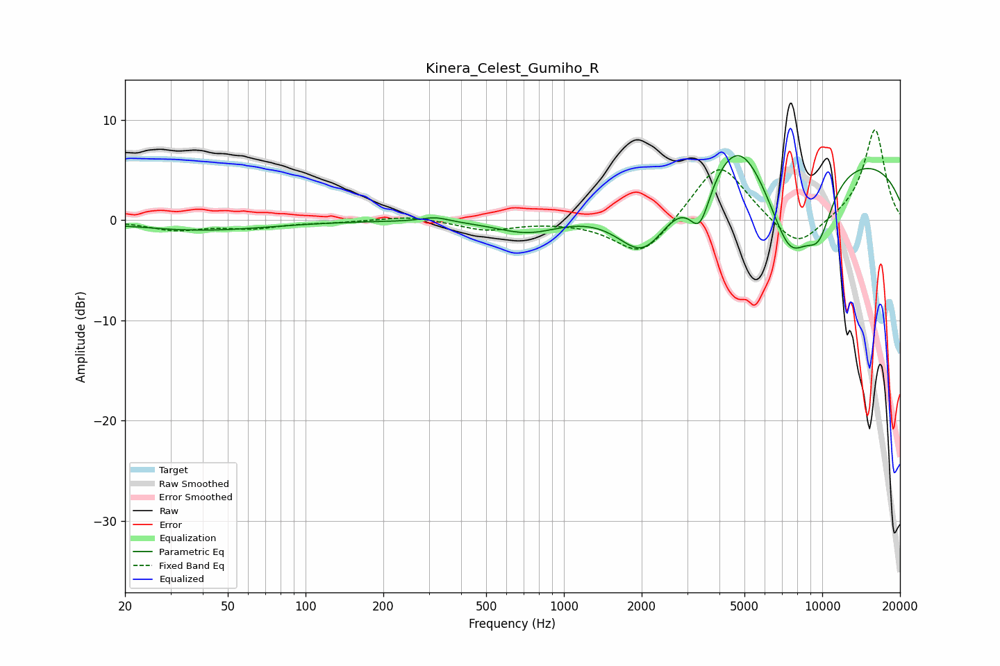

# Kinera_Celest_Gumiho_R
See [usage instructions](https://github.com/jaakkopasanen/AutoEq#usage) for more options and info.

### Parametric EQs
Apply preamp of -6.5 dB when using parametric equalizer.

|   # | Type    |   Fc (Hz) |    Q |   Gain (dB) |
|-----|---------|-----------|------|-------------|
|   1 | Peaking |        23 | 0.9  |         0   |
|   2 | Peaking |        40 | 0.54 |        -1   |
|   3 | Peaking |       318 | 2.73 |         0.5 |
|   4 | Peaking |       731 | 1.11 |        -1.6 |
|   5 | Peaking |      2030 | 1.33 |        -6.1 |
|   6 | Peaking |      3359 | 3.44 |        -4.5 |
|   7 | Peaking |      4769 | 1.39 |         4.7 |
|   8 | Peaking |      7487 | 1.42 |        -9   |
|   9 | Peaking |      9018 | 0.18 |         6.9 |
|  10 | Peaking |      9711 | 2.23 |        -4.7 |

### Fixed Band EQs
When using fixed band (also called graphic) equalizer, apply preamp of **-9.1 dB** (if available) and set gains manually with these parameters.

|   # | Type    |   Fc (Hz) |    Q |   Gain (dB) |
|-----|---------|-----------|------|-------------|
|   1 | Peaking |        31 | 1.41 |        -0.9 |
|   2 | Peaking |        62 | 1.41 |        -0.7 |
|   3 | Peaking |       125 | 1.41 |        -0.2 |
|   4 | Peaking |       250 | 1.41 |         0.4 |
|   5 | Peaking |       500 | 1.41 |        -1   |
|   6 | Peaking |      1000 | 1.41 |        -0   |
|   7 | Peaking |      2000 | 1.41 |        -3.8 |
|   8 | Peaking |      4000 | 1.41 |         6   |
|   9 | Peaking |      8000 | 1.41 |        -3.2 |
|  10 | Peaking |     16000 | 1.41 |         9.2 |

### Graphs

