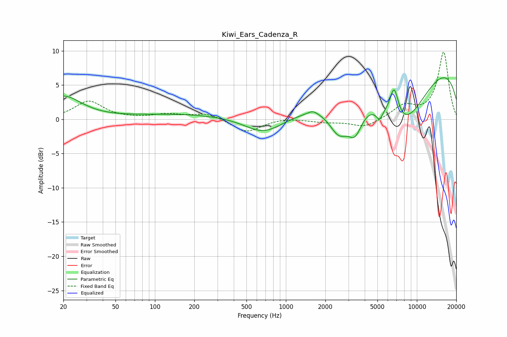

# Kiwi_Ears_Cadenza_R
See [usage instructions](https://github.com/jaakkopasanen/AutoEq#usage) for more options and info.

### Parametric EQs
Apply preamp of -6.2 dB when using parametric equalizer.

|   # | Type    |   Fc (Hz) |    Q |   Gain (dB) |
|-----|---------|-----------|------|-------------|
|   1 | Peaking |        20 | 1.04 |         3.3 |
|   2 | Peaking |       175 | 0.33 |         0.8 |
|   3 | Peaking |       679 | 0.96 |        -2.5 |
|   4 | Peaking |      1607 | 3.93 |         0.5 |
|   5 | Peaking |      2540 | 1.82 |        -4.4 |
|   6 | Peaking |      3375 | 2.58 |        -3.8 |
|   7 | Peaking |      5181 | 5.71 |        -1.4 |
|   8 | Peaking |      6702 | 4.07 |         4.5 |
|   9 | Peaking |      7881 | 0.62 |        -9.7 |
|  10 | Peaking |     10000 | 0.2  |         9.9 |

### Fixed Band EQs
When using fixed band (also called graphic) equalizer, apply preamp of **-9.9 dB** (if available) and set gains manually with these parameters.

|   # | Type    |   Fc (Hz) |    Q |   Gain (dB) |
|-----|---------|-----------|------|-------------|
|   1 | Peaking |        31 | 1.41 |         2.6 |
|   2 | Peaking |        62 | 1.41 |         0   |
|   3 | Peaking |       125 | 1.41 |         0.7 |
|   4 | Peaking |       250 | 1.41 |         0.9 |
|   5 | Peaking |       500 | 1.41 |        -1.9 |
|   6 | Peaking |      1000 | 1.41 |         0.3 |
|   7 | Peaking |      2000 | 1.41 |        -0.4 |
|   8 | Peaking |      4000 | 1.41 |        -1.2 |
|   9 | Peaking |      8000 | 1.41 |         1.9 |
|  10 | Peaking |     16000 | 1.41 |         9.8 |

### Graphs

