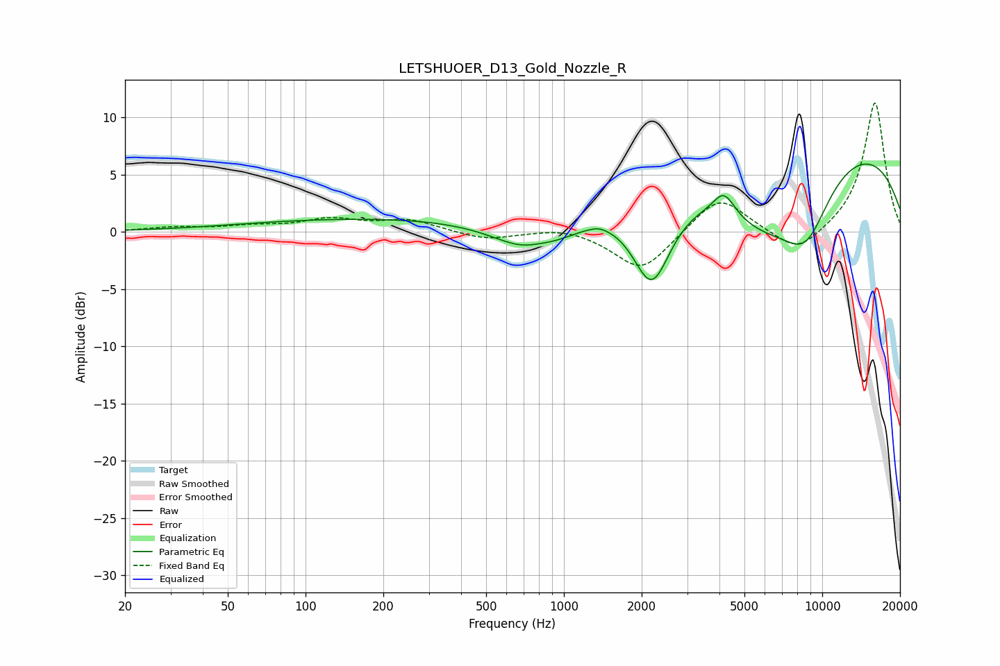

# LETSHUOER_D13_Gold_Nozzle_R
See [usage instructions](https://github.com/jaakkopasanen/AutoEq#usage) for more options and info.

### Parametric EQs
Apply preamp of -6.0 dB when using parametric equalizer.

|   # | Type    |   Fc (Hz) |    Q |   Gain (dB) |
|-----|---------|-----------|------|-------------|
|   1 | Peaking |       249 | 0.21 |         1.3 |
|   2 | Peaking |       775 | 0.96 |        -3.5 |
|   3 | Peaking |       803 | 2.31 |         0.5 |
|   4 | Peaking |      1361 | 4.44 |         0.2 |
|   5 | Peaking |      2190 | 1.82 |        -7.8 |
|   6 | Peaking |      4167 | 3.36 |         2.1 |
|   7 | Peaking |      5854 | 0.68 |        -6.7 |
|   8 | Peaking |      6818 | 0.2  |        -0.2 |
|   9 | Peaking |      8106 | 0.19 |         9.4 |
|  10 | Peaking |      8644 | 1.36 |        -5.2 |

### Fixed Band EQs
When using fixed band (also called graphic) equalizer, apply preamp of **-11.4 dB** (if available) and set gains manually with these parameters.

|   # | Type    |   Fc (Hz) |    Q |   Gain (dB) |
|-----|---------|-----------|------|-------------|
|   1 | Peaking |        31 | 1.41 |         0.4 |
|   2 | Peaking |        62 | 1.41 |         0.4 |
|   3 | Peaking |       125 | 1.41 |         1   |
|   4 | Peaking |       250 | 1.41 |         1   |
|   5 | Peaking |       500 | 1.41 |        -0.7 |
|   6 | Peaking |      1000 | 1.41 |         0.5 |
|   7 | Peaking |      2000 | 1.41 |        -3.5 |
|   8 | Peaking |      4000 | 1.41 |         3.3 |
|   9 | Peaking |      8000 | 1.41 |        -2.1 |
|  10 | Peaking |     16000 | 1.41 |        11.4 |

### Graphs

