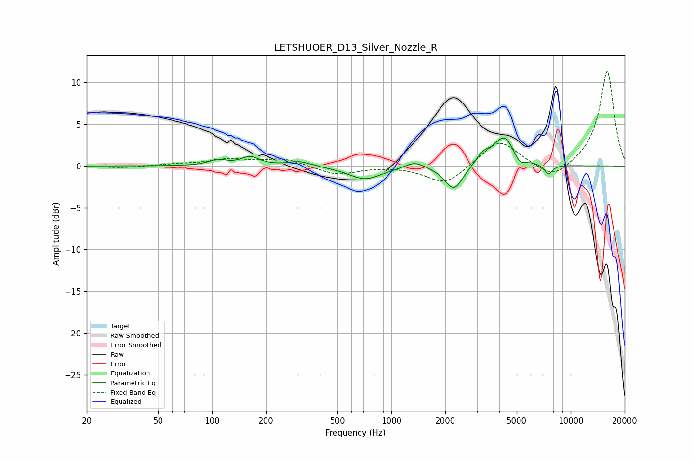

# LETSHUOER_D13_Silver_Nozzle_R
See [usage instructions](https://github.com/jaakkopasanen/AutoEq#usage) for more options and info.

### Parametric EQs
Apply preamp of -3.4 dB when using parametric equalizer.

|   # | Type    |   Fc (Hz) |    Q |   Gain (dB) |
|-----|---------|-----------|------|-------------|
|   1 | Peaking |       107 | 3.02 |         0.7 |
|   2 | Peaking |       163 | 2.8  |         1   |
|   3 | Peaking |       308 | 2.23 |         0.6 |
|   4 | Peaking |       713 | 1.53 |        -1.6 |
|   5 | Peaking |      1351 | 2.78 |         0.8 |
|   6 | Peaking |      2235 | 2.78 |        -3   |
|   7 | Peaking |      3242 | 3.55 |         1.1 |
|   8 | Peaking |      4266 | 2.36 |         3.6 |
|   9 | Peaking |      5176 | 4.42 |        -1.1 |
|  10 | Peaking |      7528 | 6    |        -1.2 |

### Fixed Band EQs
When using fixed band (also called graphic) equalizer, apply preamp of **-11.4 dB** (if available) and set gains manually with these parameters.

|   # | Type    |   Fc (Hz) |    Q |   Gain (dB) |
|-----|---------|-----------|------|-------------|
|   1 | Peaking |        31 | 1.41 |        -0.2 |
|   2 | Peaking |        62 | 1.41 |         0.2 |
|   3 | Peaking |       125 | 1.41 |         0.8 |
|   4 | Peaking |       250 | 1.41 |         0.9 |
|   5 | Peaking |       500 | 1.41 |        -1.1 |
|   6 | Peaking |      1000 | 1.41 |         0   |
|   7 | Peaking |      2000 | 1.41 |        -2.3 |
|   8 | Peaking |      4000 | 1.41 |         3.2 |
|   9 | Peaking |      8000 | 1.41 |        -1.8 |
|  10 | Peaking |     16000 | 1.41 |        11.5 |

### Graphs

