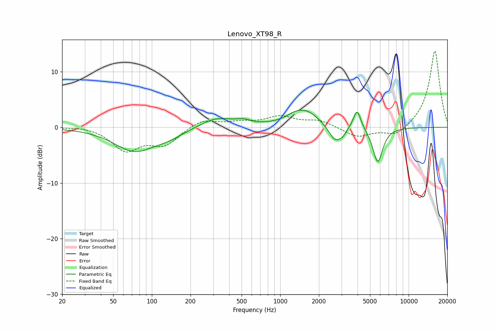

# Lenovo_XT98_R
See [usage instructions](https://github.com/jaakkopasanen/AutoEq#usage) for more options and info.

### Parametric EQs
Apply preamp of -3.2 dB when using parametric equalizer.

|   # | Type    |   Fc (Hz) |    Q |   Gain (dB) |
|-----|---------|-----------|------|-------------|
|   1 | Peaking |        73 | 0.89 |        -4.1 |
|   2 | Peaking |       136 | 1.2  |        -1.1 |
|   3 | Peaking |       319 | 1.09 |         1.8 |
|   4 | Peaking |       516 | 2.7  |         0.6 |
|   5 | Peaking |      1270 | 2.47 |         0.4 |
|   6 | Peaking |      1562 | 1.26 |         3   |
|   7 | Peaking |      2679 | 2.72 |        -3   |
|   8 | Peaking |      3063 | 5.42 |        -0.7 |
|   9 | Peaking |      3970 | 4.75 |         3.6 |
|  10 | Peaking |      5746 | 3.59 |        -6.4 |

### Fixed Band EQs
When using fixed band (also called graphic) equalizer, apply preamp of **-13.8 dB** (if available) and set gains manually with these parameters.

|   # | Type    |   Fc (Hz) |    Q |   Gain (dB) |
|-----|---------|-----------|------|-------------|
|   1 | Peaking |        31 | 1.41 |         0.3 |
|   2 | Peaking |        62 | 1.41 |        -4   |
|   3 | Peaking |       125 | 1.41 |        -3   |
|   4 | Peaking |       250 | 1.41 |         1.5 |
|   5 | Peaking |       500 | 1.41 |         0.8 |
|   6 | Peaking |      1000 | 1.41 |         1.8 |
|   7 | Peaking |      2000 | 1.41 |         1.2 |
|   8 | Peaking |      4000 | 1.41 |        -1.8 |
|   9 | Peaking |      8000 | 1.41 |        -1.7 |
|  10 | Peaking |     16000 | 1.41 |        13.9 |

### Graphs

