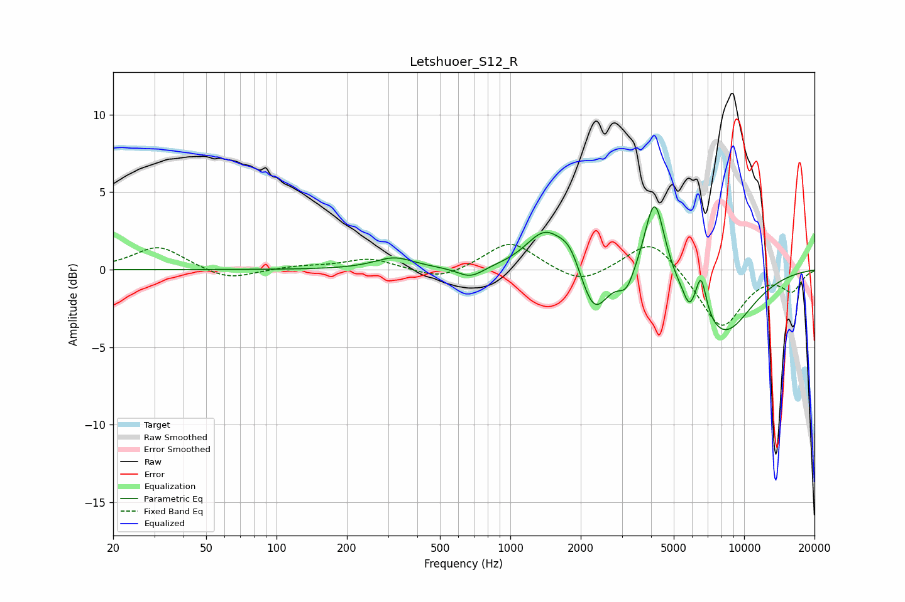

# Letshuoer_S12_R
See [usage instructions](https://github.com/jaakkopasanen/AutoEq#usage) for more options and info.

### Parametric EQs
Apply preamp of -4.2 dB when using parametric equalizer.

|   # | Type    |   Fc (Hz) |    Q |   Gain (dB) |
|-----|---------|-----------|------|-------------|
|   1 | Peaking |       319 | 1.68 |         0.8 |
|   2 | Peaking |       675 | 2.54 |        -0.7 |
|   3 | Peaking |      1408 | 1.71 |         2.5 |
|   4 | Peaking |      1799 | 2.99 |         1.3 |
|   5 | Peaking |      2278 | 2.39 |        -3.1 |
|   6 | Peaking |      3138 | 4.25 |        -1.2 |
|   7 | Peaking |      4144 | 3.23 |         5.5 |
|   8 | Peaking |      5826 | 6    |        -1   |
|   9 | Peaking |      6544 | 5.97 |         2.5 |
|  10 | Peaking |      8063 | 1.01 |        -4.2 |

### Fixed Band EQs
When using fixed band (also called graphic) equalizer, apply preamp of **-1.7 dB** (if available) and set gains manually with these parameters.

|   # | Type    |   Fc (Hz) |    Q |   Gain (dB) |
|-----|---------|-----------|------|-------------|
|   1 | Peaking |        31 | 1.41 |         1.5 |
|   2 | Peaking |        62 | 1.41 |        -0.7 |
|   3 | Peaking |       125 | 1.41 |         0.2 |
|   4 | Peaking |       250 | 1.41 |         0.7 |
|   5 | Peaking |       500 | 1.41 |        -0.7 |
|   6 | Peaking |      1000 | 1.41 |         1.9 |
|   7 | Peaking |      2000 | 1.41 |        -1   |
|   8 | Peaking |      4000 | 1.41 |         2.1 |
|   9 | Peaking |      8000 | 1.41 |        -3.8 |
|  10 | Peaking |     16000 | 1.41 |        -1.3 |

### Graphs

