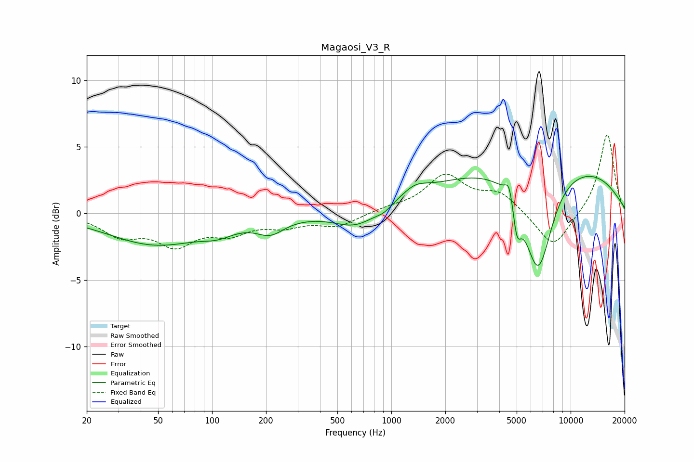

# Magaosi_V3_R
See [usage instructions](https://github.com/jaakkopasanen/AutoEq#usage) for more options and info.

### Parametric EQs
Apply preamp of -2.9 dB when using parametric equalizer.

|   # | Type    |   Fc (Hz) |    Q |   Gain (dB) |
|-----|---------|-----------|------|-------------|
|   1 | Peaking |        49 | 0.53 |        -2.3 |
|   2 | Peaking |       108 | 1.59 |        -0.6 |
|   3 | Peaking |       211 | 1.81 |        -1.1 |
|   4 | Peaking |       634 | 1.2  |        -1.3 |
|   5 | Peaking |       908 | 3.31 |        -0.3 |
|   6 | Peaking |      1350 | 1.92 |         0.8 |
|   7 | Peaking |      4560 | 6    |         1.6 |
|   8 | Peaking |      5007 | 5.88 |        -2.6 |
|   9 | Peaking |      6576 | 1.69 |        -7.9 |
|  10 | Peaking |      6821 | 0.22 |         4.1 |

### Fixed Band EQs
When using fixed band (also called graphic) equalizer, apply preamp of **-6.0 dB** (if available) and set gains manually with these parameters.

|   # | Type    |   Fc (Hz) |    Q |   Gain (dB) |
|-----|---------|-----------|------|-------------|
|   1 | Peaking |        31 | 1.41 |        -1.5 |
|   2 | Peaking |        62 | 1.41 |        -2.1 |
|   3 | Peaking |       125 | 1.41 |        -1.3 |
|   4 | Peaking |       250 | 1.41 |        -0.8 |
|   5 | Peaking |       500 | 1.41 |        -0.9 |
|   6 | Peaking |      1000 | 1.41 |         0.3 |
|   7 | Peaking |      2000 | 1.41 |         2.7 |
|   8 | Peaking |      4000 | 1.41 |         1.4 |
|   9 | Peaking |      8000 | 1.41 |        -2.7 |
|  10 | Peaking |     16000 | 1.41 |         6.1 |

### Graphs

