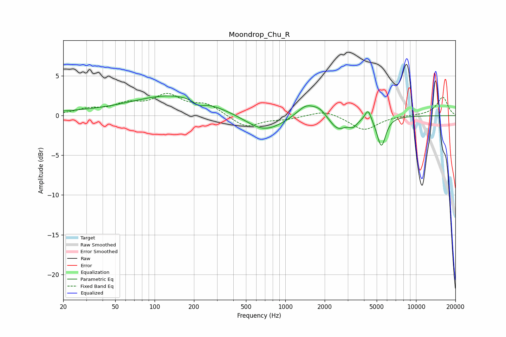

# Moondrop_Chu_R
See [usage instructions](https://github.com/jaakkopasanen/AutoEq#usage) for more options and info.

### Parametric EQs
Apply preamp of -2.6 dB when using parametric equalizer.

|   # | Type    |   Fc (Hz) |    Q |   Gain (dB) |
|-----|---------|-----------|------|-------------|
|   1 | Peaking |        43 | 0.23 |         0.5 |
|   2 | Peaking |       145 | 0.47 |         2.3 |
|   3 | Peaking |       218 | 3.46 |        -0.7 |
|   4 | Peaking |       688 | 0.99 |        -2.2 |
|   5 | Peaking |      1448 | 1.92 |         1.6 |
|   6 | Peaking |      1840 | 2.8  |         0.8 |
|   7 | Peaking |      2526 | 2.2  |        -1.7 |
|   8 | Peaking |      3296 | 4.36 |        -0.9 |
|   9 | Peaking |      4297 | 6    |         1.5 |
|  10 | Peaking |      5430 | 4.18 |        -3.8 |

### Fixed Band EQs
When using fixed band (also called graphic) equalizer, apply preamp of **-2.9 dB** (if available) and set gains manually with these parameters.

|   # | Type    |   Fc (Hz) |    Q |   Gain (dB) |
|-----|---------|-----------|------|-------------|
|   1 | Peaking |        31 | 1.41 |         0.7 |
|   2 | Peaking |        62 | 1.41 |         1.2 |
|   3 | Peaking |       125 | 1.41 |         2.4 |
|   4 | Peaking |       250 | 1.41 |         1.3 |
|   5 | Peaking |       500 | 1.41 |        -1.5 |
|   6 | Peaking |      1000 | 1.41 |        -0.4 |
|   7 | Peaking |      2000 | 1.41 |         0.7 |
|   8 | Peaking |      4000 | 1.41 |        -1.8 |
|   9 | Peaking |      8000 | 1.41 |         0   |
|  10 | Peaking |     16000 | 1.41 |         2.3 |

### Graphs

