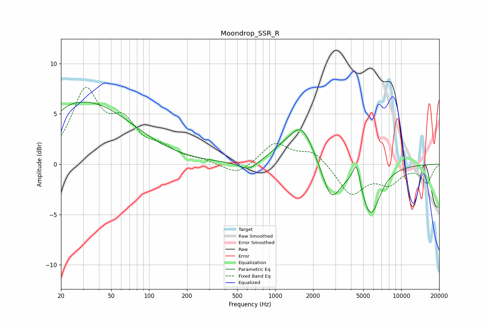

# Moondrop_SSR_R
See [usage instructions](https://github.com/jaakkopasanen/AutoEq#usage) for more options and info.

### Parametric EQs
Apply preamp of -6.3 dB when using parametric equalizer.

|   # | Type    |   Fc (Hz) |    Q |   Gain (dB) |
|-----|---------|-----------|------|-------------|
|   1 | Peaking |        20 | 0.8  |         1.4 |
|   2 | Peaking |        20 | 5.92 |        -3.4 |
|   3 | Peaking |        20 | 6    |         3.2 |
|   4 | Peaking |        37 | 0.42 |         5.4 |
|   5 | Peaking |       617 | 1.92 |        -0.9 |
|   6 | Peaking |      1125 | 1.34 |         0.9 |
|   7 | Peaking |      1624 | 1.49 |         3.6 |
|   8 | Peaking |      2789 | 1.97 |        -3.6 |
|   9 | Peaking |      4408 | 4.82 |         2.5 |
|  10 | Peaking |      5715 | 1.86 |        -4.9 |

### Fixed Band EQs
When using fixed band (also called graphic) equalizer, apply preamp of **-7.7 dB** (if available) and set gains manually with these parameters.

|   # | Type    |   Fc (Hz) |    Q |   Gain (dB) |
|-----|---------|-----------|------|-------------|
|   1 | Peaking |        31 | 1.41 |         6.9 |
|   2 | Peaking |        62 | 1.41 |         3.5 |
|   3 | Peaking |       125 | 1.41 |         1.2 |
|   4 | Peaking |       250 | 1.41 |         0.3 |
|   5 | Peaking |       500 | 1.41 |        -1.2 |
|   6 | Peaking |      1000 | 1.41 |         2.1 |
|   7 | Peaking |      2000 | 1.41 |         1.3 |
|   8 | Peaking |      4000 | 1.41 |        -3   |
|   9 | Peaking |      8000 | 1.41 |        -1.7 |
|  10 | Peaking |     16000 | 1.41 |        -1.8 |

### Graphs

