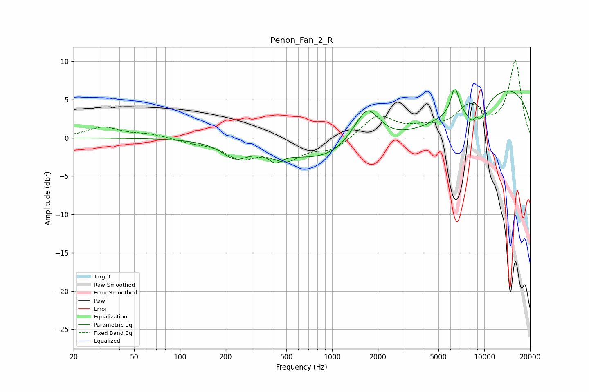

# Penon_Fan_2_R
See [usage instructions](https://github.com/jaakkopasanen/AutoEq#usage) for more options and info.

### Parametric EQs
Apply preamp of -6.5 dB when using parametric equalizer.

|   # | Type    |   Fc (Hz) |    Q |   Gain (dB) |
|-----|---------|-----------|------|-------------|
|   1 | Peaking |       230 | 1.67 |        -2   |
|   2 | Peaking |       423 | 3.32 |        -1.3 |
|   3 | Peaking |      1528 | 3.58 |        -0.3 |
|   4 | Peaking |      1669 | 1.5  |         6.3 |
|   5 | Peaking |      2654 | 0.22 |        -6.5 |
|   6 | Peaking |      6409 | 5.1  |         3.6 |
|   7 | Peaking |      8889 | 5.6  |         3   |
|   8 | Peaking |      8916 | 2.72 |        -5.1 |
|   9 | Peaking |      8991 | 0.2  |         8.9 |
|  10 | Peaking |      9022 | 5.94 |        -0.3 |

### Fixed Band EQs
When using fixed band (also called graphic) equalizer, apply preamp of **-10.2 dB** (if available) and set gains manually with these parameters.

|   # | Type    |   Fc (Hz) |    Q |   Gain (dB) |
|-----|---------|-----------|------|-------------|
|   1 | Peaking |        31 | 1.41 |         1.4 |
|   2 | Peaking |        62 | 1.41 |         0.5 |
|   3 | Peaking |       125 | 1.41 |        -0.5 |
|   4 | Peaking |       250 | 1.41 |        -2.3 |
|   5 | Peaking |       500 | 1.41 |        -2.5 |
|   6 | Peaking |      1000 | 1.41 |        -1.5 |
|   7 | Peaking |      2000 | 1.41 |         2.9 |
|   8 | Peaking |      4000 | 1.41 |         0.9 |
|   9 | Peaking |      8000 | 1.41 |         3.7 |
|  10 | Peaking |     16000 | 1.41 |        10   |

### Graphs

