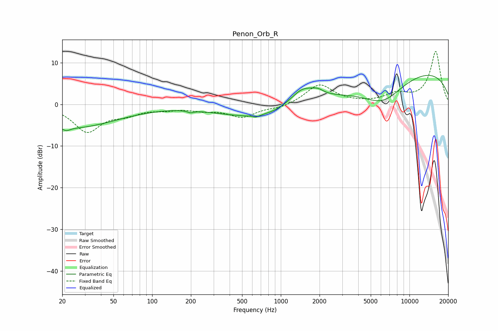

# Penon_Orb_R
See [usage instructions](https://github.com/jaakkopasanen/AutoEq#usage) for more options and info.

### Parametric EQs
Apply preamp of -7.0 dB when using parametric equalizer.

|   # | Type    |   Fc (Hz) |    Q |   Gain (dB) |
|-----|---------|-----------|------|-------------|
|   1 | Peaking |        22 | 5.06 |        -0.8 |
|   2 | Peaking |        24 | 0.4  |        -5.6 |
|   3 | Peaking |       199 | 5.97 |        -0.5 |
|   4 | Peaking |       640 | 5.84 |        -0.5 |
|   5 | Peaking |      1481 | 1.32 |         4.7 |
|   6 | Peaking |      1877 | 0.23 |        -7.1 |
|   7 | Peaking |      1949 | 3.45 |         0.9 |
|   8 | Peaking |      2305 | 0.42 |         4.4 |
|   9 | Peaking |      6228 | 0.9  |        -4.9 |
|  10 | Peaking |     10000 | 0.22 |         9   |

### Fixed Band EQs
When using fixed band (also called graphic) equalizer, apply preamp of **-12.8 dB** (if available) and set gains manually with these parameters.

|   # | Type    |   Fc (Hz) |    Q |   Gain (dB) |
|-----|---------|-----------|------|-------------|
|   1 | Peaking |        31 | 1.41 |        -6.4 |
|   2 | Peaking |        62 | 1.41 |        -1.9 |
|   3 | Peaking |       125 | 1.41 |        -0.9 |
|   4 | Peaking |       250 | 1.41 |        -1.1 |
|   5 | Peaking |       500 | 1.41 |        -2.9 |
|   6 | Peaking |      1000 | 1.41 |        -0.9 |
|   7 | Peaking |      2000 | 1.41 |         4.8 |
|   8 | Peaking |      4000 | 1.41 |         0.1 |
|   9 | Peaking |      8000 | 1.41 |         2.2 |
|  10 | Peaking |     16000 | 1.41 |        12.7 |

### Graphs

