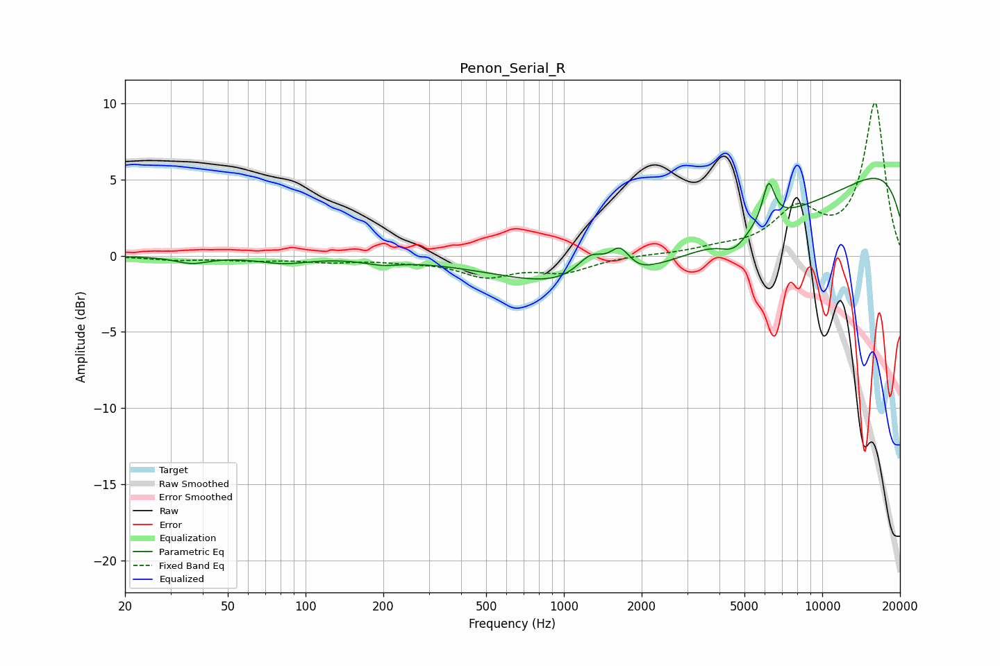

# Penon_Serial_R
See [usage instructions](https://github.com/jaakkopasanen/AutoEq#usage) for more options and info.

### Parametric EQs
Apply preamp of -5.2 dB when using parametric equalizer.

|   # | Type    |   Fc (Hz) |    Q |   Gain (dB) |
|-----|---------|-----------|------|-------------|
|   1 | Peaking |        36 | 2.31 |        -0.4 |
|   2 | Peaking |        82 | 1.53 |        -0.4 |
|   3 | Peaking |       198 | 2.04 |        -0.3 |
|   4 | Peaking |      1274 | 2.45 |         1.7 |
|   5 | Peaking |      1645 | 3.72 |         1.5 |
|   6 | Peaking |      2000 | 4.11 |        -0.1 |
|   7 | Peaking |      4033 | 0.19 |        -5.6 |
|   8 | Peaking |      4556 | 2.68 |        -1.1 |
|   9 | Peaking |      6200 | 5.9  |         2.6 |
|  10 | Peaking |      9906 | 0.18 |         8.2 |

### Fixed Band EQs
When using fixed band (also called graphic) equalizer, apply preamp of **-10.1 dB** (if available) and set gains manually with these parameters.

|   # | Type    |   Fc (Hz) |    Q |   Gain (dB) |
|-----|---------|-----------|------|-------------|
|   1 | Peaking |        31 | 1.41 |        -0.2 |
|   2 | Peaking |        62 | 1.41 |        -0.2 |
|   3 | Peaking |       125 | 1.41 |        -0.3 |
|   4 | Peaking |       250 | 1.41 |        -0.3 |
|   5 | Peaking |       500 | 1.41 |        -1.2 |
|   6 | Peaking |      1000 | 1.41 |        -1   |
|   7 | Peaking |      2000 | 1.41 |         0   |
|   8 | Peaking |      4000 | 1.41 |         0.4 |
|   9 | Peaking |      8000 | 1.41 |         2.8 |
|  10 | Peaking |     16000 | 1.41 |        10   |

### Graphs

