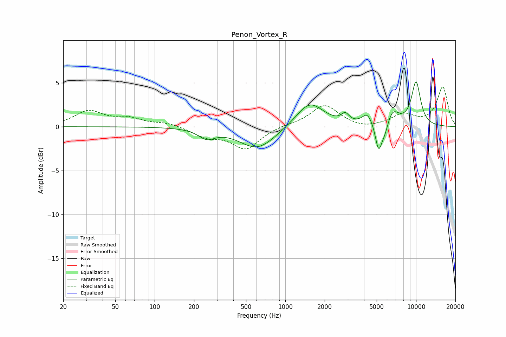

# Penon_Vortex_R
See [usage instructions](https://github.com/jaakkopasanen/AutoEq#usage) for more options and info.

### Parametric EQs
Apply preamp of -5.2 dB when using parametric equalizer.

|   # | Type    |   Fc (Hz) |    Q |   Gain (dB) |
|-----|---------|-----------|------|-------------|
|   1 | Peaking |       250 | 2.28 |        -1.1 |
|   2 | Peaking |       515 | 2.44 |        -0   |
|   3 | Peaking |       615 | 1.02 |        -2.5 |
|   4 | Peaking |      1537 | 1.35 |         2.9 |
|   5 | Peaking |      2872 | 4.84 |         0.9 |
|   6 | Peaking |      4248 | 3.6  |         1.3 |
|   7 | Peaking |      5163 | 5.63 |        -3   |
|   8 | Peaking |      5767 | 3.89 |        -1.8 |
|   9 | Peaking |      6497 | 2.55 |         2.1 |
|  10 | Peaking |     10000 | 3.41 |         4.9 |

### Fixed Band EQs
When using fixed band (also called graphic) equalizer, apply preamp of **-4.6 dB** (if available) and set gains manually with these parameters.

|   # | Type    |   Fc (Hz) |    Q |   Gain (dB) |
|-----|---------|-----------|------|-------------|
|   1 | Peaking |        31 | 1.41 |         1.7 |
|   2 | Peaking |        62 | 1.41 |         0.8 |
|   3 | Peaking |       125 | 1.41 |         0.4 |
|   4 | Peaking |       250 | 1.41 |        -1.1 |
|   5 | Peaking |       500 | 1.41 |        -2.5 |
|   6 | Peaking |      1000 | 1.41 |         0.2 |
|   7 | Peaking |      2000 | 1.41 |         2.5 |
|   8 | Peaking |      4000 | 1.41 |        -0.3 |
|   9 | Peaking |      8000 | 1.41 |         1.3 |
|  10 | Peaking |     16000 | 1.41 |         4.5 |

### Graphs

