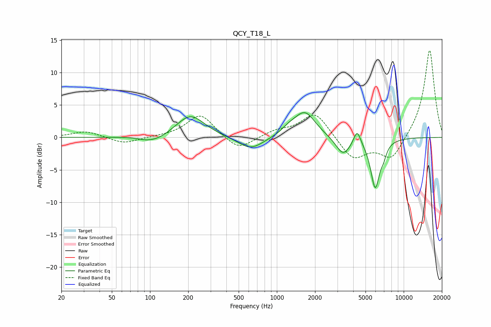

# QCY_T18_L
See [usage instructions](https://github.com/jaakkopasanen/AutoEq#usage) for more options and info.

### Parametric EQs
Apply preamp of -3.9 dB when using parametric equalizer.

|   # | Type    |   Fc (Hz) |    Q |   Gain (dB) |
|-----|---------|-----------|------|-------------|
|   1 | Peaking |        93 | 2.55 |        -0.3 |
|   2 | Peaking |       114 | 1.51 |        -0.9 |
|   3 | Peaking |       208 | 1.27 |         3.5 |
|   4 | Peaking |       624 | 1.41 |        -2   |
|   5 | Peaking |      1243 | 2.39 |         0.8 |
|   6 | Peaking |      1662 | 1.7  |         3.9 |
|   7 | Peaking |      3325 | 2.48 |        -2.7 |
|   8 | Peaking |      4295 | 5.12 |         2.3 |
|   9 | Peaking |      5960 | 3.78 |        -7.6 |
|  10 | Peaking |      6940 | 6    |        -1.2 |

### Fixed Band EQs
When using fixed band (also called graphic) equalizer, apply preamp of **-13.5 dB** (if available) and set gains manually with these parameters.

|   # | Type    |   Fc (Hz) |    Q |   Gain (dB) |
|-----|---------|-----------|------|-------------|
|   1 | Peaking |        31 | 1.41 |         1   |
|   2 | Peaking |        62 | 1.41 |        -1   |
|   3 | Peaking |       125 | 1.41 |         0.1 |
|   4 | Peaking |       250 | 1.41 |         3.6 |
|   5 | Peaking |       500 | 1.41 |        -2.2 |
|   6 | Peaking |      1000 | 1.41 |         0.9 |
|   7 | Peaking |      2000 | 1.41 |         3.9 |
|   8 | Peaking |      4000 | 1.41 |        -3.5 |
|   9 | Peaking |      8000 | 1.41 |        -3.5 |
|  10 | Peaking |     16000 | 1.41 |        13.7 |

### Graphs

