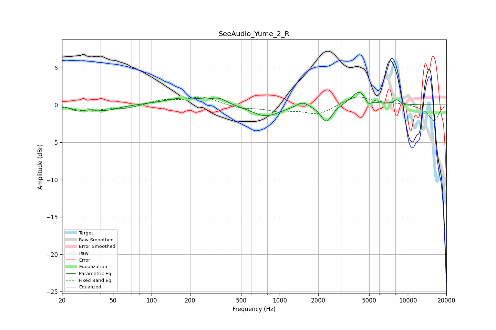

# SeeAudio_Yume_2_R
See [usage instructions](https://github.com/jaakkopasanen/AutoEq#usage) for more options and info.

### Parametric EQs
Apply preamp of -1.8 dB when using parametric equalizer.

|   # | Type    |   Fc (Hz) |    Q |   Gain (dB) |
|-----|---------|-----------|------|-------------|
|   1 | Peaking |        27 | 2.92 |        -0.6 |
|   2 | Peaking |        44 | 1.45 |        -0.7 |
|   3 | Peaking |       183 | 0.92 |         1   |
|   4 | Peaking |       336 | 2.44 |         0.7 |
|   5 | Peaking |       776 | 1.27 |        -1.6 |
|   6 | Peaking |      1506 | 2.94 |         0.8 |
|   7 | Peaking |      2320 | 3.25 |        -2.3 |
|   8 | Peaking |      4187 | 2.43 |         2   |
|   9 | Peaking |      4903 | 6    |        -0.8 |
|  10 | Peaking |      8193 | 5.53 |         0.6 |

### Fixed Band EQs
When using fixed band (also called graphic) equalizer, apply preamp of **-1.2 dB** (if available) and set gains manually with these parameters.

|   # | Type    |   Fc (Hz) |    Q |   Gain (dB) |
|-----|---------|-----------|------|-------------|
|   1 | Peaking |        31 | 1.41 |        -0.8 |
|   2 | Peaking |        62 | 1.41 |        -0.4 |
|   3 | Peaking |       125 | 1.41 |         0.6 |
|   4 | Peaking |       250 | 1.41 |         1.1 |
|   5 | Peaking |       500 | 1.41 |        -0.5 |
|   6 | Peaking |      1000 | 1.41 |        -0.7 |
|   7 | Peaking |      2000 | 1.41 |        -1.2 |
|   8 | Peaking |      4000 | 1.41 |         1.3 |
|   9 | Peaking |      8000 | 1.41 |         0.2 |
|  10 | Peaking |     16000 | 1.41 |        -2.2 |

### Graphs

