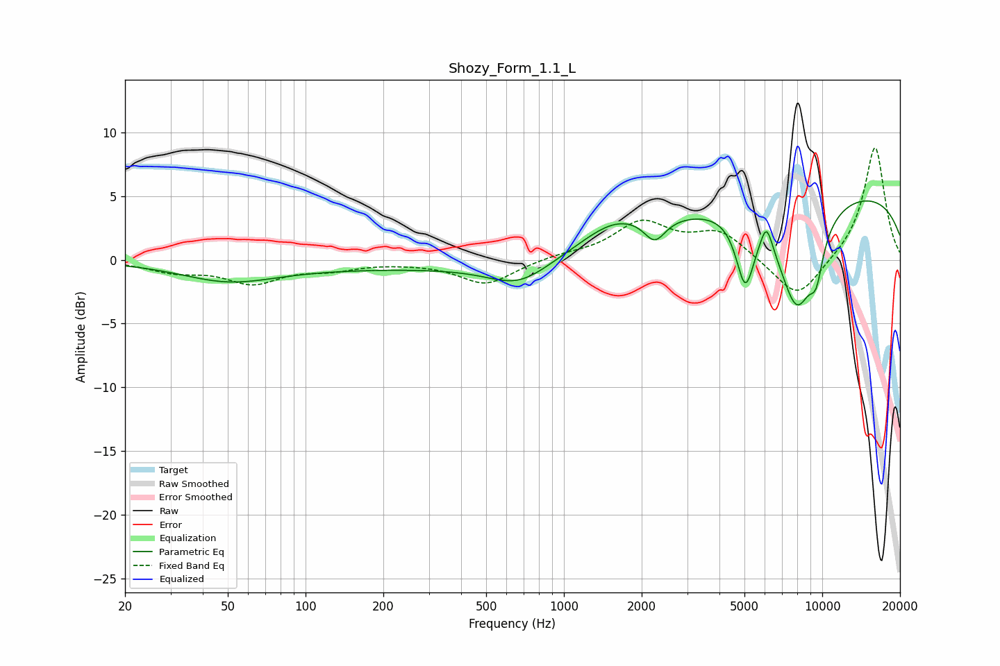

# Shozy_Form_1.1_L
See [usage instructions](https://github.com/jaakkopasanen/AutoEq#usage) for more options and info.

### Parametric EQs
Apply preamp of -4.7 dB when using parametric equalizer.

|   # | Type    |   Fc (Hz) |    Q |   Gain (dB) |
|-----|---------|-----------|------|-------------|
|   1 | Peaking |        50 | 0.77 |        -1.4 |
|   2 | Peaking |       262 | 0.19 |        -0.6 |
|   3 | Peaking |       669 | 1.18 |        -1.8 |
|   4 | Peaking |      1556 | 1.08 |         1.8 |
|   5 | Peaking |      2247 | 3.42 |        -1.8 |
|   6 | Peaking |      5035 | 3.93 |        -5.2 |
|   7 | Peaking |      6084 | 5.97 |         2.1 |
|   8 | Peaking |      7974 | 1.77 |        -8.4 |
|   9 | Peaking |      9484 | 4.69 |        -2.7 |
|  10 | Peaking |      9995 | 0.18 |         5.6 |

### Fixed Band EQs
When using fixed band (also called graphic) equalizer, apply preamp of **-8.9 dB** (if available) and set gains manually with these parameters.

|   # | Type    |   Fc (Hz) |    Q |   Gain (dB) |
|-----|---------|-----------|------|-------------|
|   1 | Peaking |        31 | 1.41 |        -0.8 |
|   2 | Peaking |        62 | 1.41 |        -1.7 |
|   3 | Peaking |       125 | 1.41 |        -0.6 |
|   4 | Peaking |       250 | 1.41 |        -0.1 |
|   5 | Peaking |       500 | 1.41 |        -1.9 |
|   6 | Peaking |      1000 | 1.41 |         0.3 |
|   7 | Peaking |      2000 | 1.41 |         2.8 |
|   8 | Peaking |      4000 | 1.41 |         2.1 |
|   9 | Peaking |      8000 | 1.41 |        -3.3 |
|  10 | Peaking |     16000 | 1.41 |         9   |

### Graphs

