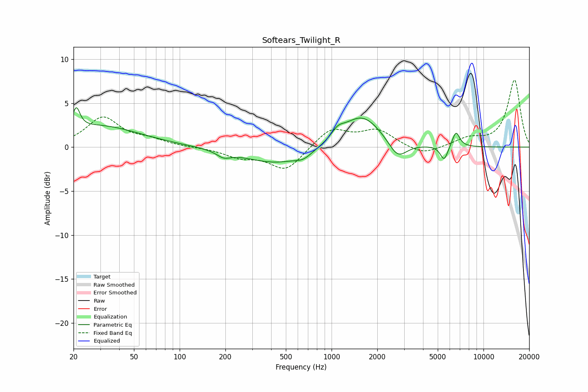

# Softears_Twilight_R
See [usage instructions](https://github.com/jaakkopasanen/AutoEq#usage) for more options and info.

### Parametric EQs
Apply preamp of -4.6 dB when using parametric equalizer.

|   # | Type    |   Fc (Hz) |    Q |   Gain (dB) |
|-----|---------|-----------|------|-------------|
|   1 | Peaking |        21 | 5.97 |         2.4 |
|   2 | Peaking |        29 | 0.52 |         2.4 |
|   3 | Peaking |       195 | 3.06 |        -0.7 |
|   4 | Peaking |       435 | 0.67 |        -1.9 |
|   5 | Peaking |       653 | 2.64 |        -0.6 |
|   6 | Peaking |      1098 | 3.31 |         1   |
|   7 | Peaking |      1582 | 1.09 |         3.7 |
|   8 | Peaking |      2722 | 2.29 |        -2.1 |
|   9 | Peaking |      5507 | 5.63 |        -1.7 |
|  10 | Peaking |      6593 | 5.54 |         1.8 |

### Fixed Band EQs
When using fixed band (also called graphic) equalizer, apply preamp of **-7.7 dB** (if available) and set gains manually with these parameters.

|   # | Type    |   Fc (Hz) |    Q |   Gain (dB) |
|-----|---------|-----------|------|-------------|
|   1 | Peaking |        31 | 1.41 |         3.3 |
|   2 | Peaking |        62 | 1.41 |         0.7 |
|   3 | Peaking |       125 | 1.41 |        -0   |
|   4 | Peaking |       250 | 1.41 |        -1   |
|   5 | Peaking |       500 | 1.41 |        -2.6 |
|   6 | Peaking |      1000 | 1.41 |         2.1 |
|   7 | Peaking |      2000 | 1.41 |         1.9 |
|   8 | Peaking |      4000 | 1.41 |        -1   |
|   9 | Peaking |      8000 | 1.41 |         0.9 |
|  10 | Peaking |     16000 | 1.41 |         7.6 |

### Graphs

