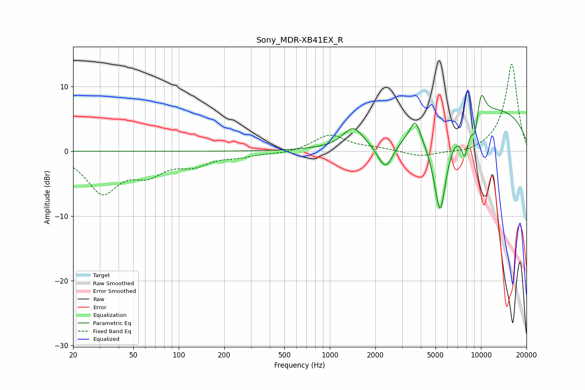

# Sony_MDR-XB41EX_R
See [usage instructions](https://github.com/jaakkopasanen/AutoEq#usage) for more options and info.

### Parametric EQs
Apply preamp of -8.7 dB when using parametric equalizer.

|   # | Type    |   Fc (Hz) |    Q |   Gain (dB) |
|-----|---------|-----------|------|-------------|
|   1 | Peaking |      1418 | 2.32 |         2.8 |
|   2 | Peaking |      2336 | 2.49 |        -5   |
|   3 | Peaking |      2999 | 4.83 |        -0.1 |
|   4 | Peaking |      3672 | 4.42 |         3.1 |
|   5 | Peaking |      5346 | 2.79 |       -13.6 |
|   6 | Peaking |      5461 | 5.29 |        -1   |
|   7 | Peaking |      7808 | 5.04 |        -4.9 |
|   8 | Peaking |      9130 | 5.49 |        -3.4 |
|   9 | Peaking |     10000 | 4.39 |         4   |
|  10 | Peaking |     10000 | 0.23 |         6.9 |

### Fixed Band EQs
When using fixed band (also called graphic) equalizer, apply preamp of **-13.6 dB** (if available) and set gains manually with these parameters.

|   # | Type    |   Fc (Hz) |    Q |   Gain (dB) |
|-----|---------|-----------|------|-------------|
|   1 | Peaking |        31 | 1.41 |        -6.1 |
|   2 | Peaking |        62 | 1.41 |        -2.9 |
|   3 | Peaking |       125 | 1.41 |        -1.8 |
|   4 | Peaking |       250 | 1.41 |        -0.6 |
|   5 | Peaking |       500 | 1.41 |        -0.4 |
|   6 | Peaking |      1000 | 1.41 |         2.6 |
|   7 | Peaking |      2000 | 1.41 |         0.4 |
|   8 | Peaking |      4000 | 1.41 |        -0.9 |
|   9 | Peaking |      8000 | 1.41 |        -0.5 |
|  10 | Peaking |     16000 | 1.41 |        13.6 |

### Graphs

