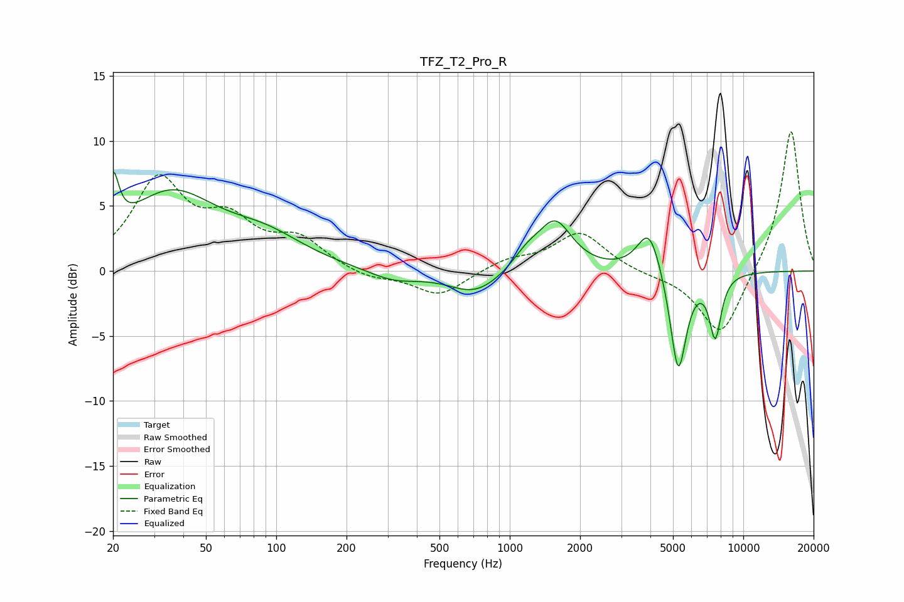

# TFZ_T2_Pro_R
See [usage instructions](https://github.com/jaakkopasanen/AutoEq#usage) for more options and info.

### Parametric EQs
Apply preamp of -7.7 dB when using parametric equalizer.

|   # | Type    |   Fc (Hz) |    Q |   Gain (dB) |
|-----|---------|-----------|------|-------------|
|   1 | Peaking |        20 | 5.92 |         4.2 |
|   2 | Peaking |        35 | 0.71 |         5.7 |
|   3 | Peaking |        91 | 0.84 |         1.9 |
|   4 | Peaking |       318 | 1.29 |        -0.8 |
|   5 | Peaking |       713 | 1.25 |        -1.8 |
|   6 | Peaking |      1182 | 2.33 |         1.1 |
|   7 | Peaking |      1565 | 1.94 |         3.7 |
|   8 | Peaking |      3957 | 2.77 |         3.5 |
|   9 | Peaking |      5265 | 3.97 |        -8.1 |
|  10 | Peaking |      7588 | 5.21 |        -4.7 |

### Fixed Band EQs
When using fixed band (also called graphic) equalizer, apply preamp of **-10.8 dB** (if available) and set gains manually with these parameters.

|   # | Type    |   Fc (Hz) |    Q |   Gain (dB) |
|-----|---------|-----------|------|-------------|
|   1 | Peaking |        31 | 1.41 |         6.7 |
|   2 | Peaking |        62 | 1.41 |         3.2 |
|   3 | Peaking |       125 | 1.41 |         2.2 |
|   4 | Peaking |       250 | 1.41 |        -0.6 |
|   5 | Peaking |       500 | 1.41 |        -1.9 |
|   6 | Peaking |      1000 | 1.41 |         0.8 |
|   7 | Peaking |      2000 | 1.41 |         3   |
|   8 | Peaking |      4000 | 1.41 |        -0.2 |
|   9 | Peaking |      8000 | 1.41 |        -5.2 |
|  10 | Peaking |     16000 | 1.41 |        11   |

### Graphs

