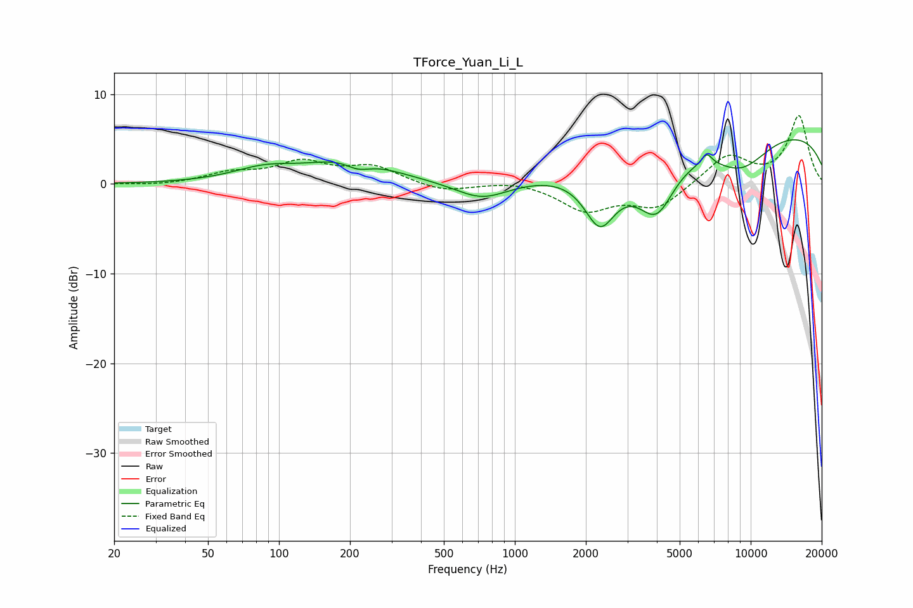

# TForce_Yuan_Li_L
See [usage instructions](https://github.com/jaakkopasanen/AutoEq#usage) for more options and info.

### Parametric EQs
Apply preamp of -5.0 dB when using parametric equalizer.

|   # | Type    |   Fc (Hz) |    Q |   Gain (dB) |
|-----|---------|-----------|------|-------------|
|   1 | Peaking |        87 | 1.03 |         1.4 |
|   2 | Peaking |       202 | 0.83 |         2.7 |
|   3 | Peaking |       216 | 2.56 |        -1.1 |
|   4 | Peaking |       727 | 1.25 |        -2   |
|   5 | Peaking |      2297 | 2.08 |        -6   |
|   6 | Peaking |      4012 | 1.36 |       -10.4 |
|   7 | Peaking |      4260 | 1.08 |         3.5 |
|   8 | Peaking |      6512 | 5.93 |         1.2 |
|   9 | Peaking |      9092 | 1.02 |        -3.9 |
|  10 | Peaking |      9962 | 0.18 |         6.4 |

### Fixed Band EQs
When using fixed band (also called graphic) equalizer, apply preamp of **-7.7 dB** (if available) and set gains manually with these parameters.

|   # | Type    |   Fc (Hz) |    Q |   Gain (dB) |
|-----|---------|-----------|------|-------------|
|   1 | Peaking |        31 | 1.41 |        -0.2 |
|   2 | Peaking |        62 | 1.41 |         1.1 |
|   3 | Peaking |       125 | 1.41 |         2.3 |
|   4 | Peaking |       250 | 1.41 |         1.8 |
|   5 | Peaking |       500 | 1.41 |        -0.9 |
|   6 | Peaking |      1000 | 1.41 |         0.4 |
|   7 | Peaking |      2000 | 1.41 |        -2.9 |
|   8 | Peaking |      4000 | 1.41 |        -2.6 |
|   9 | Peaking |      8000 | 1.41 |         3.2 |
|  10 | Peaking |     16000 | 1.41 |         7.5 |

### Graphs

