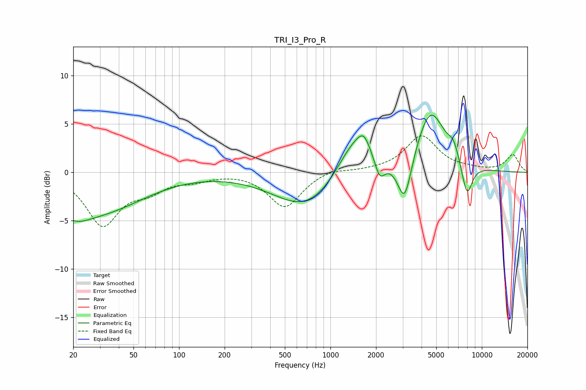

# TRI_I3_Pro_R
See [usage instructions](https://github.com/jaakkopasanen/AutoEq#usage) for more options and info.

### Parametric EQs
Apply preamp of -6.0 dB when using parametric equalizer.

|   # | Type    |   Fc (Hz) |    Q |   Gain (dB) |
|-----|---------|-----------|------|-------------|
|   1 | Peaking |        20 | 1.36 |        -1.9 |
|   2 | Peaking |        31 | 0.5  |        -3.7 |
|   3 | Peaking |       704 | 0.66 |        -3.8 |
|   4 | Peaking |      1428 | 1.21 |         4.2 |
|   5 | Peaking |      1663 | 3.29 |         1.7 |
|   6 | Peaking |      2117 | 4.17 |        -2.1 |
|   7 | Peaking |      3090 | 3.04 |        -4.9 |
|   8 | Peaking |      4579 | 1.45 |         6.4 |
|   9 | Peaking |      6506 | 3.77 |         1.4 |
|  10 | Peaking |      7975 | 3.75 |        -3.5 |

### Fixed Band EQs
When using fixed band (also called graphic) equalizer, apply preamp of **-3.9 dB** (if available) and set gains manually with these parameters.

|   # | Type    |   Fc (Hz) |    Q |   Gain (dB) |
|-----|---------|-----------|------|-------------|
|   1 | Peaking |        31 | 1.41 |        -5.3 |
|   2 | Peaking |        62 | 1.41 |        -1.5 |
|   3 | Peaking |       125 | 1.41 |        -0.6 |
|   4 | Peaking |       250 | 1.41 |         0.1 |
|   5 | Peaking |       500 | 1.41 |        -3.6 |
|   6 | Peaking |      1000 | 1.41 |         0.4 |
|   7 | Peaking |      2000 | 1.41 |         0.1 |
|   8 | Peaking |      4000 | 1.41 |         3.7 |
|   9 | Peaking |      8000 | 1.41 |         0.2 |
|  10 | Peaking |     16000 | 1.41 |         1.8 |

### Graphs

