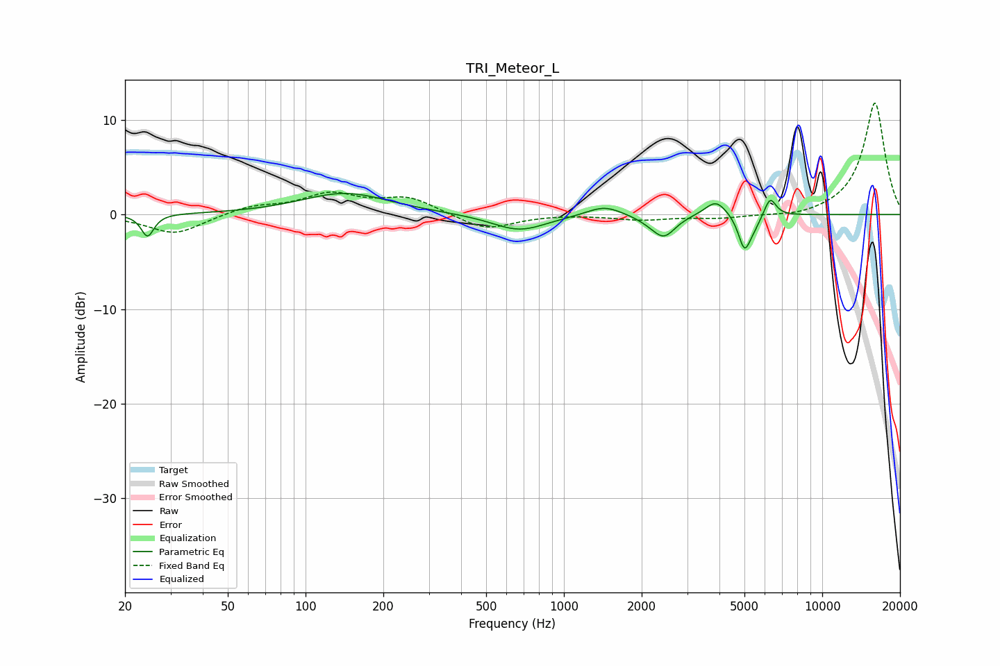

# TRI_Meteor_L
See [usage instructions](https://github.com/jaakkopasanen/AutoEq#usage) for more options and info.

### Parametric EQs
Apply preamp of -2.3 dB when using parametric equalizer.

|   # | Type    |   Fc (Hz) |    Q |   Gain (dB) |
|-----|---------|-----------|------|-------------|
|   1 | Peaking |        24 | 5.95 |        -2.4 |
|   2 | Peaking |       142 | 0.83 |         2.3 |
|   3 | Peaking |       672 | 1.34 |        -1.7 |
|   4 | Peaking |      1434 | 2.04 |         1.1 |
|   5 | Peaking |      2210 | 2.47 |        -0.5 |
|   6 | Peaking |      2446 | 3.25 |        -2   |
|   7 | Peaking |      3879 | 3.3  |         1.7 |
|   8 | Peaking |      4996 | 6    |        -3.4 |
|   9 | Peaking |      5411 | 4.39 |        -1   |
|  10 | Peaking |      6281 | 6    |         2.1 |

### Fixed Band EQs
When using fixed band (also called graphic) equalizer, apply preamp of **-11.9 dB** (if available) and set gains manually with these parameters.

|   # | Type    |   Fc (Hz) |    Q |   Gain (dB) |
|-----|---------|-----------|------|-------------|
|   1 | Peaking |        31 | 1.41 |        -2.1 |
|   2 | Peaking |        62 | 1.41 |         0.8 |
|   3 | Peaking |       125 | 1.41 |         2   |
|   4 | Peaking |       250 | 1.41 |         1.7 |
|   5 | Peaking |       500 | 1.41 |        -1.7 |
|   6 | Peaking |      1000 | 1.41 |         0.1 |
|   7 | Peaking |      2000 | 1.41 |        -0.5 |
|   8 | Peaking |      4000 | 1.41 |        -0.4 |
|   9 | Peaking |      8000 | 1.41 |        -0.4 |
|  10 | Peaking |     16000 | 1.41 |        11.9 |

### Graphs

