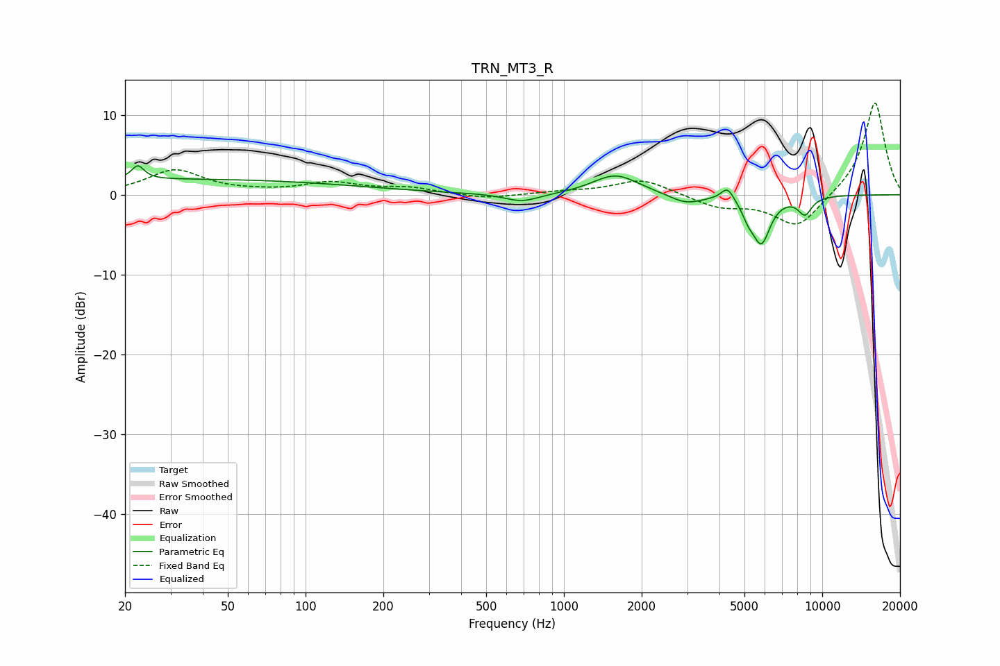

# TRN_MT3_R
See [usage instructions](https://github.com/jaakkopasanen/AutoEq#usage) for more options and info.

### Parametric EQs
Apply preamp of -3.7 dB when using parametric equalizer.

|   # | Type    |   Fc (Hz) |    Q |   Gain (dB) |
|-----|---------|-----------|------|-------------|
|   1 | Peaking |        22 | 5.93 |         1.7 |
|   2 | Peaking |        32 | 0.18 |         1.9 |
|   3 | Peaking |       687 | 2.14 |        -1   |
|   4 | Peaking |       961 | 1.1  |        -0.1 |
|   5 | Peaking |      1584 | 1.59 |         2.6 |
|   6 | Peaking |      2966 | 2.19 |        -1.2 |
|   7 | Peaking |      4300 | 5.65 |         1.7 |
|   8 | Peaking |      5170 | 6    |        -1.4 |
|   9 | Peaking |      5811 | 3.92 |        -5.8 |
|  10 | Peaking |      8574 | 4.8  |        -2.2 |

### Fixed Band EQs
When using fixed band (also called graphic) equalizer, apply preamp of **-11.6 dB** (if available) and set gains manually with these parameters.

|   # | Type    |   Fc (Hz) |    Q |   Gain (dB) |
|-----|---------|-----------|------|-------------|
|   1 | Peaking |        31 | 1.41 |         3   |
|   2 | Peaking |        62 | 1.41 |         0.2 |
|   3 | Peaking |       125 | 1.41 |         1.4 |
|   4 | Peaking |       250 | 1.41 |         0.8 |
|   5 | Peaking |       500 | 1.41 |        -0.6 |
|   6 | Peaking |      1000 | 1.41 |         0.3 |
|   7 | Peaking |      2000 | 1.41 |         2   |
|   8 | Peaking |      4000 | 1.41 |        -1.5 |
|   9 | Peaking |      8000 | 1.41 |        -4.2 |
|  10 | Peaking |     16000 | 1.41 |        11.8 |

### Graphs

