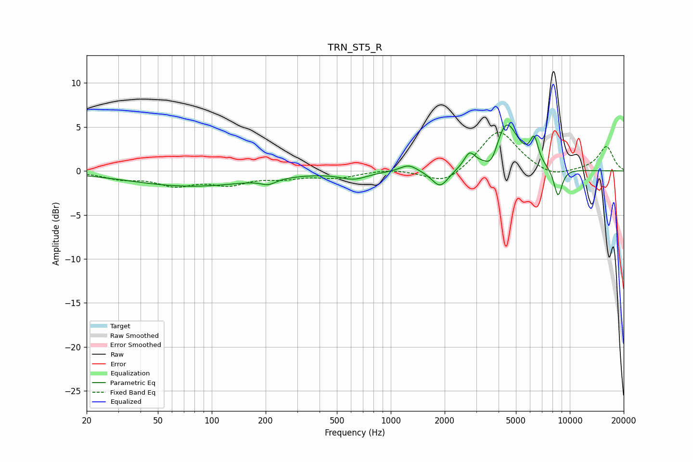

# TRN_ST5_R
See [usage instructions](https://github.com/jaakkopasanen/AutoEq#usage) for more options and info.

### Parametric EQs
Apply preamp of -5.3 dB when using parametric equalizer.

|   # | Type    |   Fc (Hz) |    Q |   Gain (dB) |
|-----|---------|-----------|------|-------------|
|   1 | Peaking |        77 | 0.41 |        -1.7 |
|   2 | Peaking |       207 | 3.33 |        -0.6 |
|   3 | Peaking |       621 | 1.91 |        -0.8 |
|   4 | Peaking |      1259 | 2.96 |         0.8 |
|   5 | Peaking |      1887 | 3.04 |        -2   |
|   6 | Peaking |      2752 | 4.7  |         1.6 |
|   7 | Peaking |      3664 | 3.69 |        -2.1 |
|   8 | Peaking |      4402 | 2.12 |         5.8 |
|   9 | Peaking |      6327 | 5.96 |         2.8 |
|  10 | Peaking |      8594 | 5.54 |        -3.3 |

### Fixed Band EQs
When using fixed band (also called graphic) equalizer, apply preamp of **-4.5 dB** (if available) and set gains manually with these parameters.

|   # | Type    |   Fc (Hz) |    Q |   Gain (dB) |
|-----|---------|-----------|------|-------------|
|   1 | Peaking |        31 | 1.41 |        -0.8 |
|   2 | Peaking |        62 | 1.41 |        -1.4 |
|   3 | Peaking |       125 | 1.41 |        -1.3 |
|   4 | Peaking |       250 | 1.41 |        -0.7 |
|   5 | Peaking |       500 | 1.41 |        -0.7 |
|   6 | Peaking |      1000 | 1.41 |         0.3 |
|   7 | Peaking |      2000 | 1.41 |        -1.6 |
|   8 | Peaking |      4000 | 1.41 |         4.8 |
|   9 | Peaking |      8000 | 1.41 |        -0.9 |
|  10 | Peaking |     16000 | 1.41 |         2.8 |

### Graphs

