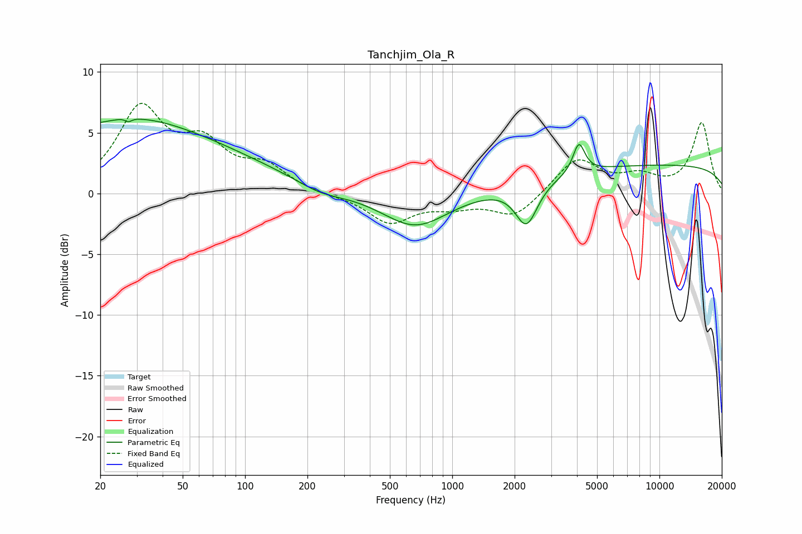

# Tanchjim_Ola_R
See [usage instructions](https://github.com/jaakkopasanen/AutoEq#usage) for more options and info.

### Parametric EQs
Apply preamp of -6.2 dB when using parametric equalizer.

|   # | Type    |   Fc (Hz) |    Q |   Gain (dB) |
|-----|---------|-----------|------|-------------|
|   1 | Peaking |        22 | 0.18 |         5   |
|   2 | Peaking |        27 | 5.55 |         3.2 |
|   3 | Peaking |        27 | 5.92 |        -3.4 |
|   4 | Peaking |        33 | 0.66 |         1.1 |
|   5 | Peaking |       231 | 1.35 |        -0.6 |
|   6 | Peaking |       664 | 0.9  |        -2.9 |
|   7 | Peaking |      2007 | 2.86 |         0   |
|   8 | Peaking |      2282 | 2.65 |        -3.5 |
|   9 | Peaking |      4085 | 4.98 |         2.5 |
|  10 | Peaking |     10000 | 0.18 |         2.3 |

### Fixed Band EQs
When using fixed band (also called graphic) equalizer, apply preamp of **-7.5 dB** (if available) and set gains manually with these parameters.

|   # | Type    |   Fc (Hz) |    Q |   Gain (dB) |
|-----|---------|-----------|------|-------------|
|   1 | Peaking |        31 | 1.41 |         6.7 |
|   2 | Peaking |        62 | 1.41 |         3.5 |
|   3 | Peaking |       125 | 1.41 |         2   |
|   4 | Peaking |       250 | 1.41 |        -0.2 |
|   5 | Peaking |       500 | 1.41 |        -2.4 |
|   6 | Peaking |      1000 | 1.41 |        -0.8 |
|   7 | Peaking |      2000 | 1.41 |        -2   |
|   8 | Peaking |      4000 | 1.41 |         2.9 |
|   9 | Peaking |      8000 | 1.41 |         1.2 |
|  10 | Peaking |     16000 | 1.41 |         5.8 |

### Graphs

