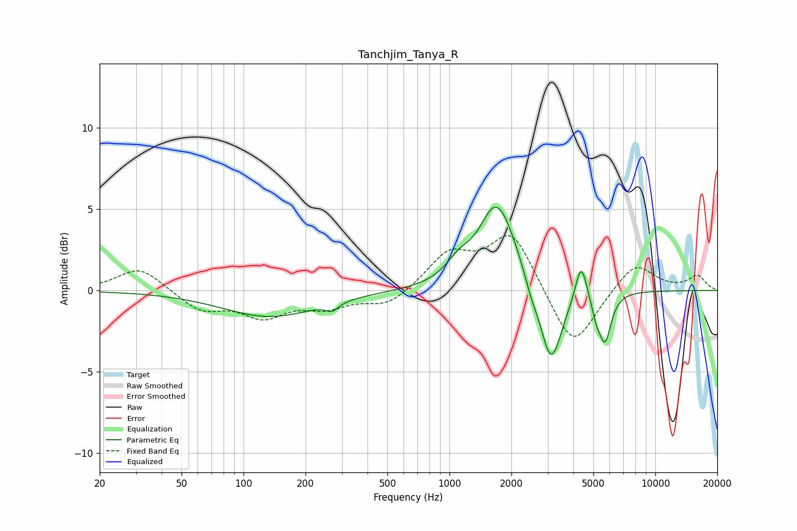

# Tanchjim_Tanya_R
See [usage instructions](https://github.com/jaakkopasanen/AutoEq#usage) for more options and info.

### Parametric EQs
Apply preamp of -5.2 dB when using parametric equalizer.

|   # | Type    |   Fc (Hz) |    Q |   Gain (dB) |
|-----|---------|-----------|------|-------------|
|   1 | Peaking |       134 | 0.61 |        -1.6 |
|   2 | Peaking |       269 | 4.6  |        -0.5 |
|   3 | Peaking |      1105 | 2.38 |         1   |
|   4 | Peaking |      1591 | 3.24 |         0.3 |
|   5 | Peaking |      1726 | 1.55 |         5.2 |
|   6 | Peaking |      2491 | 4.81 |        -0.6 |
|   7 | Peaking |      3114 | 2.6  |        -5   |
|   8 | Peaking |      4365 | 5.09 |         2.4 |
|   9 | Peaking |      5168 | 6    |        -1   |
|  10 | Peaking |      5705 | 4.69 |        -2.9 |

### Fixed Band EQs
When using fixed band (also called graphic) equalizer, apply preamp of **-3.5 dB** (if available) and set gains manually with these parameters.

|   # | Type    |   Fc (Hz) |    Q |   Gain (dB) |
|-----|---------|-----------|------|-------------|
|   1 | Peaking |        31 | 1.41 |         1.5 |
|   2 | Peaking |        62 | 1.41 |        -1.2 |
|   3 | Peaking |       125 | 1.41 |        -1.5 |
|   4 | Peaking |       250 | 1.41 |        -0.9 |
|   5 | Peaking |       500 | 1.41 |        -1   |
|   6 | Peaking |      1000 | 1.41 |         2.2 |
|   7 | Peaking |      2000 | 1.41 |         3.6 |
|   8 | Peaking |      4000 | 1.41 |        -3.7 |
|   9 | Peaking |      8000 | 1.41 |         1.8 |
|  10 | Peaking |     16000 | 1.41 |         0.9 |

### Graphs

