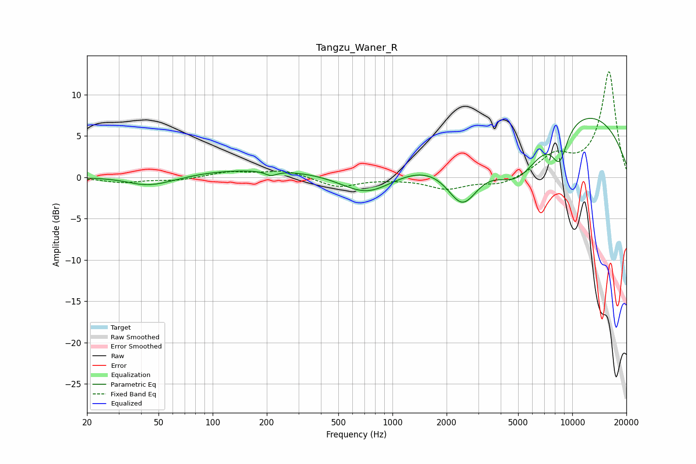

# Tangzu_Waner_R
See [usage instructions](https://github.com/jaakkopasanen/AutoEq#usage) for more options and info.

### Parametric EQs
Apply preamp of -7.2 dB when using parametric equalizer.

|   # | Type    |   Fc (Hz) |    Q |   Gain (dB) |
|-----|---------|-----------|------|-------------|
|   1 | Peaking |        40 | 1.8  |        -0.3 |
|   2 | Peaking |        49 | 1.01 |        -1.3 |
|   3 | Peaking |        57 | 3.18 |         0.1 |
|   4 | Peaking |       203 | 0.23 |         1.1 |
|   5 | Peaking |       211 | 4.43 |        -0.6 |
|   6 | Peaking |       724 | 0.93 |        -3.1 |
|   7 | Peaking |      2454 | 1.52 |        -6.1 |
|   8 | Peaking |      4943 | 0.87 |        -7.7 |
|   9 | Peaking |      7913 | 0.22 |         9.5 |
|  10 | Peaking |      8501 | 2.98 |        -4.1 |

### Fixed Band EQs
When using fixed band (also called graphic) equalizer, apply preamp of **-12.8 dB** (if available) and set gains manually with these parameters.

|   # | Type    |   Fc (Hz) |    Q |   Gain (dB) |
|-----|---------|-----------|------|-------------|
|   1 | Peaking |        31 | 1.41 |        -0.6 |
|   2 | Peaking |        62 | 1.41 |        -0.4 |
|   3 | Peaking |       125 | 1.41 |         0.6 |
|   4 | Peaking |       250 | 1.41 |         0.8 |
|   5 | Peaking |       500 | 1.41 |        -1.2 |
|   6 | Peaking |      1000 | 1.41 |        -0.1 |
|   7 | Peaking |      2000 | 1.41 |        -1.3 |
|   8 | Peaking |      4000 | 1.41 |        -1   |
|   9 | Peaking |      8000 | 1.41 |         2.5 |
|  10 | Peaking |     16000 | 1.41 |        12.7 |

### Graphs

