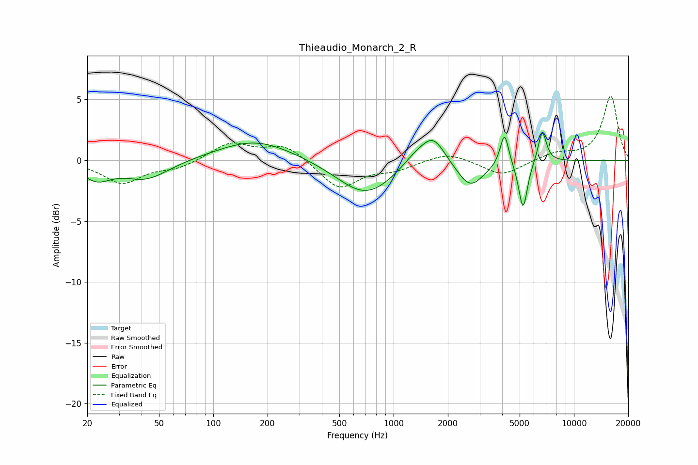

# Thieaudio_Monarch_2_R
See [usage instructions](https://github.com/jaakkopasanen/AutoEq#usage) for more options and info.

### Parametric EQs
Apply preamp of -2.3 dB when using parametric equalizer.

|   # | Type    |   Fc (Hz) |    Q |   Gain (dB) |
|-----|---------|-----------|------|-------------|
|   1 | Peaking |        23 | 1.79 |        -1.4 |
|   2 | Peaking |        43 | 1.11 |        -1.5 |
|   3 | Peaking |       172 | 0.68 |         1.7 |
|   4 | Peaking |       702 | 0.9  |        -2.9 |
|   5 | Peaking |      1323 | 1.73 |         1   |
|   6 | Peaking |      1661 | 2.15 |         2.1 |
|   7 | Peaking |      2662 | 1.93 |        -2.2 |
|   8 | Peaking |      4120 | 6    |         2.7 |
|   9 | Peaking |      5223 | 5.79 |        -4   |
|  10 | Peaking |      6677 | 5.98 |         2.6 |

### Fixed Band EQs
When using fixed band (also called graphic) equalizer, apply preamp of **-5.4 dB** (if available) and set gains manually with these parameters.

|   # | Type    |   Fc (Hz) |    Q |   Gain (dB) |
|-----|---------|-----------|------|-------------|
|   1 | Peaking |        31 | 1.41 |        -1.8 |
|   2 | Peaking |        62 | 1.41 |        -0.6 |
|   3 | Peaking |       125 | 1.41 |         1.4 |
|   4 | Peaking |       250 | 1.41 |         1.3 |
|   5 | Peaking |       500 | 1.41 |        -2.3 |
|   6 | Peaking |      1000 | 1.41 |        -0.7 |
|   7 | Peaking |      2000 | 1.41 |         0.7 |
|   8 | Peaking |      4000 | 1.41 |        -1.3 |
|   9 | Peaking |      8000 | 1.41 |         0.6 |
|  10 | Peaking |     16000 | 1.41 |         5.3 |

### Graphs

