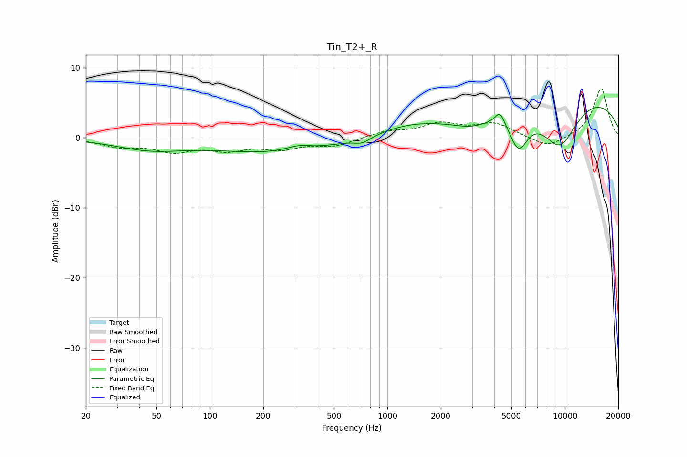

# Tin_T2+_R
See [usage instructions](https://github.com/jaakkopasanen/AutoEq#usage) for more options and info.

### Parametric EQs
Apply preamp of -4.4 dB when using parametric equalizer.

|   # | Type    |   Fc (Hz) |    Q |   Gain (dB) |
|-----|---------|-----------|------|-------------|
|   1 | Peaking |        46 | 0.73 |        -1.5 |
|   2 | Peaking |       239 | 0.4  |        -2.1 |
|   3 | Peaking |       316 | 2.01 |         0.7 |
|   4 | Peaking |       722 | 3.15 |        -0.8 |
|   5 | Peaking |      1299 | 0.79 |         1.3 |
|   6 | Peaking |      3015 | 1.24 |        -1.6 |
|   7 | Peaking |      4306 | 5.35 |         1.8 |
|   8 | Peaking |      5486 | 2.67 |        -5   |
|   9 | Peaking |      9345 | 1.17 |        -7.2 |
|  10 | Peaking |      9921 | 0.24 |         6.6 |

### Fixed Band EQs
When using fixed band (also called graphic) equalizer, apply preamp of **-7.0 dB** (if available) and set gains manually with these parameters.

|   # | Type    |   Fc (Hz) |    Q |   Gain (dB) |
|-----|---------|-----------|------|-------------|
|   1 | Peaking |        31 | 1.41 |        -1.2 |
|   2 | Peaking |        62 | 1.41 |        -1.7 |
|   3 | Peaking |       125 | 1.41 |        -1.5 |
|   4 | Peaking |       250 | 1.41 |        -1.4 |
|   5 | Peaking |       500 | 1.41 |        -1.1 |
|   6 | Peaking |      1000 | 1.41 |         0.8 |
|   7 | Peaking |      2000 | 1.41 |         1.8 |
|   8 | Peaking |      4000 | 1.41 |         1.9 |
|   9 | Peaking |      8000 | 1.41 |        -1.6 |
|  10 | Peaking |     16000 | 1.41 |         7   |

### Graphs

