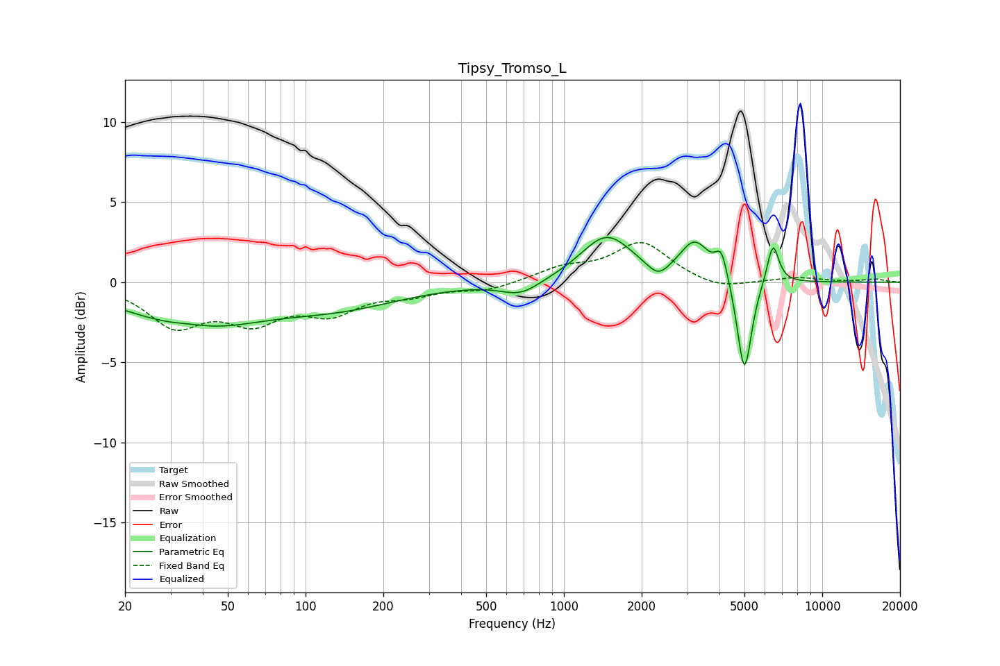

# Tipsy_Tromso_L
See [usage instructions](https://github.com/jaakkopasanen/AutoEq#usage) for more options and info.

### Parametric EQs
Apply preamp of -2.9 dB when using parametric equalizer.

|   # | Type    |   Fc (Hz) |    Q |   Gain (dB) |
|-----|---------|-----------|------|-------------|
|   1 | Peaking |        36 | 1.71 |         0.3 |
|   2 | Peaking |        37 | 0.55 |        -2.6 |
|   3 | Peaking |       136 | 0.57 |        -1.3 |
|   4 | Peaking |       681 | 1.85 |        -0.9 |
|   5 | Peaking |      1463 | 1.41 |         2.9 |
|   6 | Peaking |      2318 | 3.41 |        -0.9 |
|   7 | Peaking |      3211 | 2.45 |         2.3 |
|   8 | Peaking |      4073 | 6    |         1.7 |
|   9 | Peaking |      4998 | 5.07 |        -6.1 |
|  10 | Peaking |      6445 | 6    |         2.6 |

### Fixed Band EQs
When using fixed band (also called graphic) equalizer, apply preamp of **-2.6 dB** (if available) and set gains manually with these parameters.

|   # | Type    |   Fc (Hz) |    Q |   Gain (dB) |
|-----|---------|-----------|------|-------------|
|   1 | Peaking |        31 | 1.41 |        -2.5 |
|   2 | Peaking |        62 | 1.41 |        -2.1 |
|   3 | Peaking |       125 | 1.41 |        -1.7 |
|   4 | Peaking |       250 | 1.41 |        -0.6 |
|   5 | Peaking |       500 | 1.41 |        -0.5 |
|   6 | Peaking |      1000 | 1.41 |         0.8 |
|   7 | Peaking |      2000 | 1.41 |         2.4 |
|   8 | Peaking |      4000 | 1.41 |        -0.5 |
|   9 | Peaking |      8000 | 1.41 |         0.3 |
|  10 | Peaking |     16000 | 1.41 |         0.2 |

### Graphs

