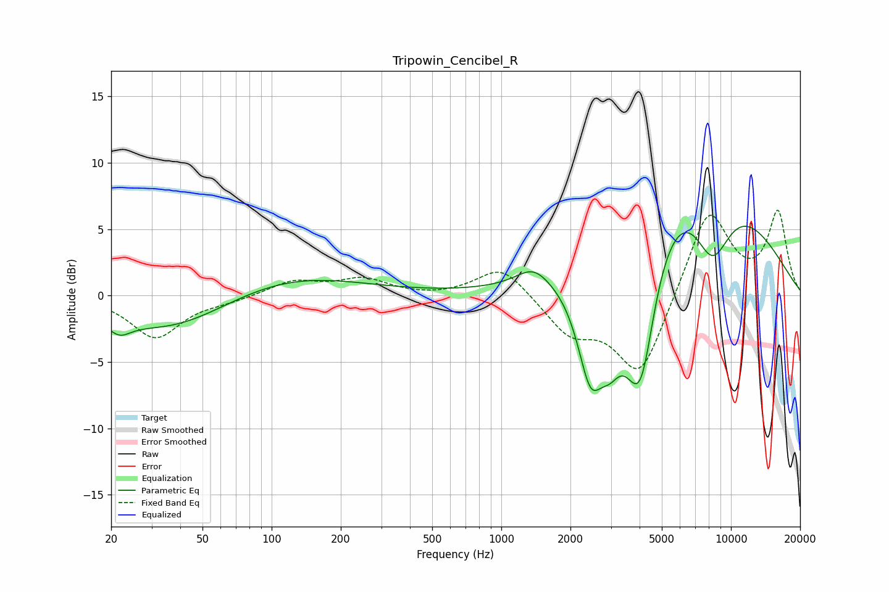

# Tripowin_Cencibel_R
See [usage instructions](https://github.com/jaakkopasanen/AutoEq#usage) for more options and info.

### Parametric EQs
Apply preamp of -5.3 dB when using parametric equalizer.

|   # | Type    |   Fc (Hz) |    Q |   Gain (dB) |
|-----|---------|-----------|------|-------------|
|   1 | Peaking |        22 | 2.88 |        -1.1 |
|   2 | Peaking |        38 | 0.48 |        -4.6 |
|   3 | Peaking |        69 | 0.33 |         2.9 |
|   4 | Peaking |      1377 | 1.96 |         1.4 |
|   5 | Peaking |      2446 | 2.33 |        -7.6 |
|   6 | Peaking |      2980 | 2.71 |        -3.4 |
|   7 | Peaking |      3766 | 1.8  |        -4.3 |
|   8 | Peaking |      4078 | 2.34 |        -7.3 |
|   9 | Peaking |      7143 | 0.42 |        10.5 |
|  10 | Peaking |      8280 | 1.48 |        -6.2 |

### Fixed Band EQs
When using fixed band (also called graphic) equalizer, apply preamp of **-6.5 dB** (if available) and set gains manually with these parameters.

|   # | Type    |   Fc (Hz) |    Q |   Gain (dB) |
|-----|---------|-----------|------|-------------|
|   1 | Peaking |        31 | 1.41 |        -3.2 |
|   2 | Peaking |        62 | 1.41 |        -0.3 |
|   3 | Peaking |       125 | 1.41 |         1.1 |
|   4 | Peaking |       250 | 1.41 |         1.2 |
|   5 | Peaking |       500 | 1.41 |        -0.1 |
|   6 | Peaking |      1000 | 1.41 |         2.3 |
|   7 | Peaking |      2000 | 1.41 |        -2.7 |
|   8 | Peaking |      4000 | 1.41 |        -6.1 |
|   9 | Peaking |      8000 | 1.41 |         6.6 |
|  10 | Peaking |     16000 | 1.41 |         6.2 |

### Graphs

