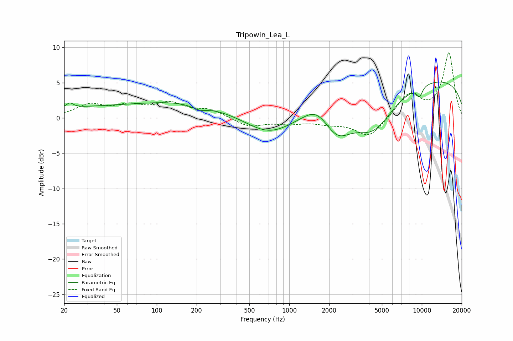

# Tripowin_Lea_L
See [usage instructions](https://github.com/jaakkopasanen/AutoEq#usage) for more options and info.

### Parametric EQs
Apply preamp of -5.2 dB when using parametric equalizer.

|   # | Type    |   Fc (Hz) |    Q |   Gain (dB) |
|-----|---------|-----------|------|-------------|
|   1 | Peaking |        22 | 5.56 |         0.7 |
|   2 | Peaking |        58 | 0.19 |         1.6 |
|   3 | Peaking |       184 | 0.46 |         1   |
|   4 | Peaking |       211 | 2.42 |        -0.7 |
|   5 | Peaking |       705 | 0.81 |        -2.6 |
|   6 | Peaking |      1593 | 1.48 |         1.8 |
|   7 | Peaking |      2309 | 1.4  |        -3.6 |
|   8 | Peaking |      4294 | 0.88 |        -5.9 |
|   9 | Peaking |      9628 | 5.48 |        -1.4 |
|  10 | Peaking |     10000 | 0.18 |         5.8 |

### Fixed Band EQs
When using fixed band (also called graphic) equalizer, apply preamp of **-9.3 dB** (if available) and set gains manually with these parameters.

|   # | Type    |   Fc (Hz) |    Q |   Gain (dB) |
|-----|---------|-----------|------|-------------|
|   1 | Peaking |        31 | 1.41 |         1.7 |
|   2 | Peaking |        62 | 1.41 |         1.5 |
|   3 | Peaking |       125 | 1.41 |         1.9 |
|   4 | Peaking |       250 | 1.41 |         1.1 |
|   5 | Peaking |       500 | 1.41 |        -1.2 |
|   6 | Peaking |      1000 | 1.41 |        -0.7 |
|   7 | Peaking |      2000 | 1.41 |        -0.6 |
|   8 | Peaking |      4000 | 1.41 |        -2.8 |
|   9 | Peaking |      8000 | 1.41 |         3.3 |
|  10 | Peaking |     16000 | 1.41 |         9.2 |

### Graphs

