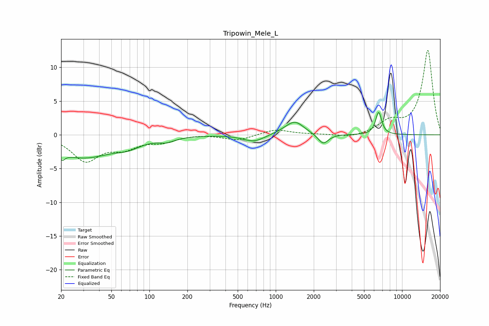

# Tripowin_Mele_L
See [usage instructions](https://github.com/jaakkopasanen/AutoEq#usage) for more options and info.

### Parametric EQs
Apply preamp of -3.4 dB when using parametric equalizer.

|   # | Type    |   Fc (Hz) |    Q |   Gain (dB) |
|-----|---------|-----------|------|-------------|
|   1 | Peaking |        20 | 5.97 |        -3.5 |
|   2 | Peaking |        21 | 5.99 |         2.4 |
|   3 | Peaking |        30 | 0.6  |        -3.3 |
|   4 | Peaking |        68 | 1.46 |        -0.9 |
|   5 | Peaking |       137 | 2.32 |        -0.6 |
|   6 | Peaking |       671 | 1.7  |        -1.1 |
|   7 | Peaking |      1237 | 1.64 |         0.4 |
|   8 | Peaking |      1429 | 2.03 |         1.7 |
|   9 | Peaking |      2374 | 3.46 |        -1.5 |
|  10 | Peaking |      6524 | 5.77 |         3.3 |

### Fixed Band EQs
When using fixed band (also called graphic) equalizer, apply preamp of **-12.6 dB** (if available) and set gains manually with these parameters.

|   # | Type    |   Fc (Hz) |    Q |   Gain (dB) |
|-----|---------|-----------|------|-------------|
|   1 | Peaking |        31 | 1.41 |        -3.7 |
|   2 | Peaking |        62 | 1.41 |        -1.7 |
|   3 | Peaking |       125 | 1.41 |        -0.9 |
|   4 | Peaking |       250 | 1.41 |         0.1 |
|   5 | Peaking |       500 | 1.41 |        -0.8 |
|   6 | Peaking |      1000 | 1.41 |         0.8 |
|   7 | Peaking |      2000 | 1.41 |         0   |
|   8 | Peaking |      4000 | 1.41 |        -0.5 |
|   9 | Peaking |      8000 | 1.41 |         1.8 |
|  10 | Peaking |     16000 | 1.41 |        12.5 |

### Graphs

