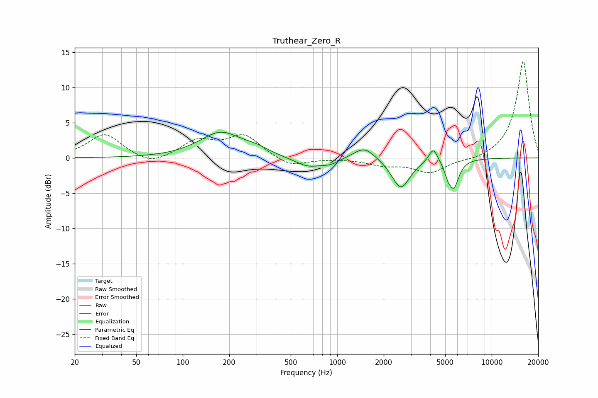

# Truthear_Zero_R
See [usage instructions](https://github.com/jaakkopasanen/AutoEq#usage) for more options and info.

### Parametric EQs
Apply preamp of -3.7 dB when using parametric equalizer.

|   # | Type    |   Fc (Hz) |    Q |   Gain (dB) |
|-----|---------|-----------|------|-------------|
|   1 | Peaking |       177 | 1.04 |         3.6 |
|   2 | Peaking |       301 | 1.89 |         0.7 |
|   3 | Peaking |       649 | 1.56 |        -1.4 |
|   4 | Peaking |       903 | 2.64 |        -0.6 |
|   5 | Peaking |      1497 | 2.08 |         1.8 |
|   6 | Peaking |      2581 | 2.42 |        -4.3 |
|   7 | Peaking |      4188 | 4.85 |         2.1 |
|   8 | Peaking |      5215 | 6    |        -1.5 |
|   9 | Peaking |      5446 | 3.83 |         0.6 |
|  10 | Peaking |      5685 | 4.24 |        -4.2 |

### Fixed Band EQs
When using fixed band (also called graphic) equalizer, apply preamp of **-13.8 dB** (if available) and set gains manually with these parameters.

|   # | Type    |   Fc (Hz) |    Q |   Gain (dB) |
|-----|---------|-----------|------|-------------|
|   1 | Peaking |        31 | 1.41 |         3.4 |
|   2 | Peaking |        62 | 1.41 |        -1.2 |
|   3 | Peaking |       125 | 1.41 |         2.3 |
|   4 | Peaking |       250 | 1.41 |         3.1 |
|   5 | Peaking |       500 | 1.41 |        -1.3 |
|   6 | Peaking |      1000 | 1.41 |        -0   |
|   7 | Peaking |      2000 | 1.41 |        -0.9 |
|   8 | Peaking |      4000 | 1.41 |        -2.1 |
|   9 | Peaking |      8000 | 1.41 |        -0.4 |
|  10 | Peaking |     16000 | 1.41 |        13.8 |

### Graphs

