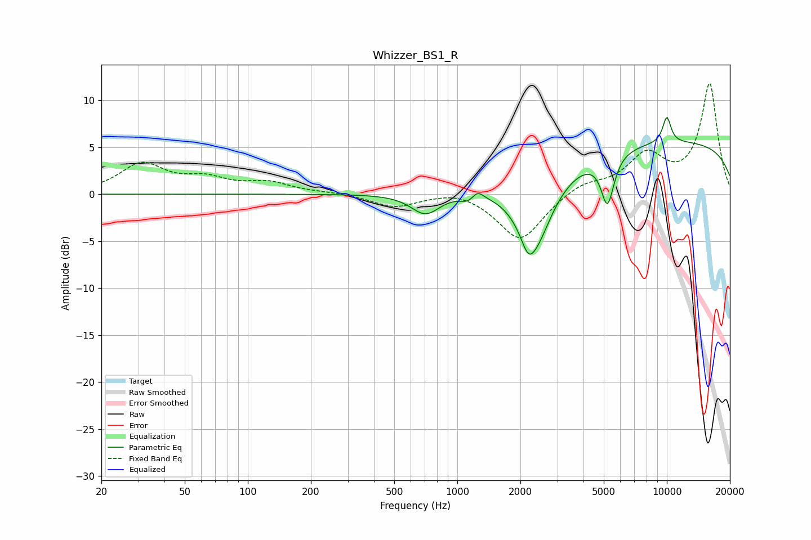

# Whizzer_BS1_R
See [usage instructions](https://github.com/jaakkopasanen/AutoEq#usage) for more options and info.

### Parametric EQs
Apply preamp of -8.3 dB when using parametric equalizer.

|   # | Type    |   Fc (Hz) |    Q |   Gain (dB) |
|-----|---------|-----------|------|-------------|
|   1 | Peaking |       665 | 2.93 |         0   |
|   2 | Peaking |       705 | 2.06 |        -2.3 |
|   3 | Peaking |      1126 | 4.09 |        -0.7 |
|   4 | Peaking |      1249 | 5.42 |         0.8 |
|   5 | Peaking |      2179 | 4.62 |        -1.7 |
|   6 | Peaking |      2336 | 1.63 |        -7.8 |
|   7 | Peaking |      5204 | 4.59 |        -5.2 |
|   8 | Peaking |      5645 | 5.42 |        -0.1 |
|   9 | Peaking |     10000 | 0.18 |         5.6 |
|  10 | Peaking |     10000 | 6    |         2.8 |

### Fixed Band EQs
When using fixed band (also called graphic) equalizer, apply preamp of **-11.9 dB** (if available) and set gains manually with these parameters.

|   # | Type    |   Fc (Hz) |    Q |   Gain (dB) |
|-----|---------|-----------|------|-------------|
|   1 | Peaking |        31 | 1.41 |         3.1 |
|   2 | Peaking |        62 | 1.41 |         1.4 |
|   3 | Peaking |       125 | 1.41 |         1.1 |
|   4 | Peaking |       250 | 1.41 |         0.2 |
|   5 | Peaking |       500 | 1.41 |        -1.3 |
|   6 | Peaking |      1000 | 1.41 |         0.6 |
|   7 | Peaking |      2000 | 1.41 |        -5   |
|   8 | Peaking |      4000 | 1.41 |         1.2 |
|   9 | Peaking |      8000 | 1.41 |         3.9 |
|  10 | Peaking |     16000 | 1.41 |        11.7 |

### Graphs

