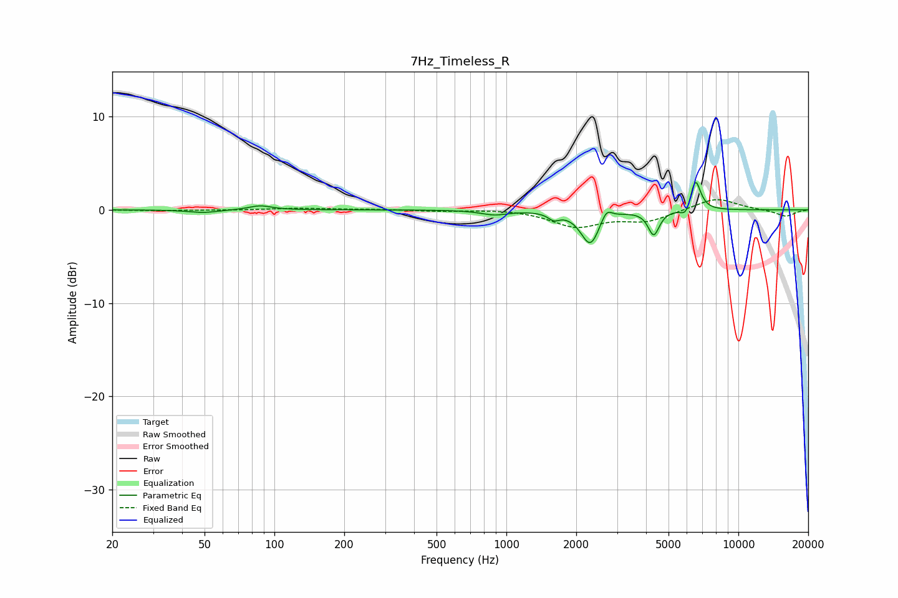

# 7Hz_Timeless_R
See [usage instructions](https://github.com/jaakkopasanen/AutoEq#usage) for more options and info.

### Parametric EQs
Apply preamp of -3.0 dB when using parametric equalizer.

|   # | Type    |   Fc (Hz) |    Q |   Gain (dB) |
|-----|---------|-----------|------|-------------|
|   1 | Peaking |        49 | 2.15 |        -0.3 |
|   2 | Peaking |        87 | 2.94 |         0.5 |
|   3 | Peaking |       886 | 2.51 |        -0.5 |
|   4 | Peaking |      1600 | 5.93 |        -0.7 |
|   5 | Peaking |      2301 | 3.51 |        -3.7 |
|   6 | Peaking |      2695 | 6    |         1.3 |
|   7 | Peaking |      4317 | 5.91 |        -2.6 |
|   8 | Peaking |      5979 | 6    |        -1.3 |
|   9 | Peaking |      6504 | 6    |         2.9 |
|  10 | Peaking |      6558 | 6    |         0.7 |

### Fixed Band EQs
When using fixed band (also called graphic) equalizer, apply preamp of **-1.2 dB** (if available) and set gains manually with these parameters.

|   # | Type    |   Fc (Hz) |    Q |   Gain (dB) |
|-----|---------|-----------|------|-------------|
|   1 | Peaking |        31 | 1.41 |        -0.1 |
|   2 | Peaking |        62 | 1.41 |        -0   |
|   3 | Peaking |       125 | 1.41 |         0.2 |
|   4 | Peaking |       250 | 1.41 |         0.1 |
|   5 | Peaking |       500 | 1.41 |        -0.1 |
|   6 | Peaking |      1000 | 1.41 |         0.1 |
|   7 | Peaking |      2000 | 1.41 |        -1.7 |
|   8 | Peaking |      4000 | 1.41 |        -1.2 |
|   9 | Peaking |      8000 | 1.41 |         1.3 |
|  10 | Peaking |     16000 | 1.41 |        -0.7 |

### Graphs

