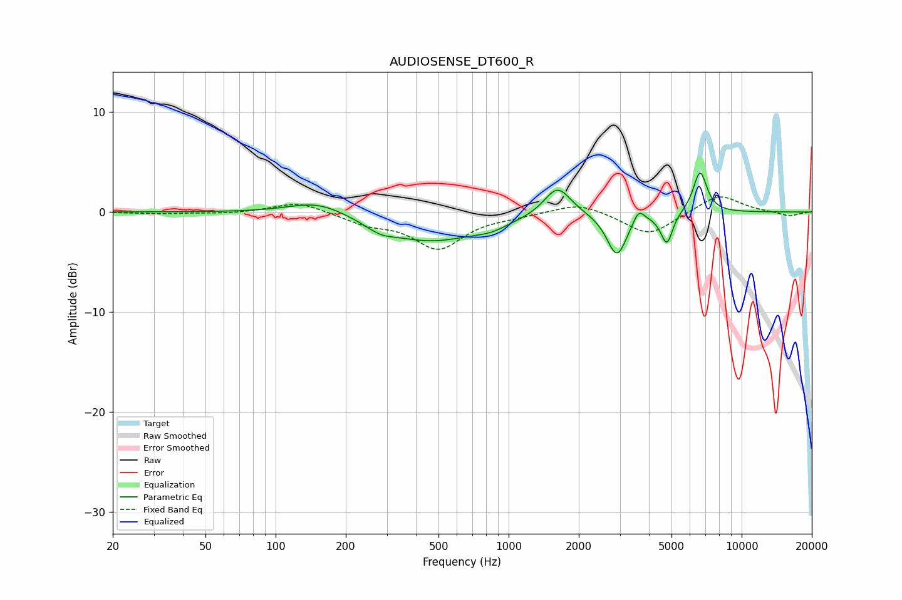

# AUDIOSENSE_DT600_R
See [usage instructions](https://github.com/jaakkopasanen/AutoEq#usage) for more options and info.

### Parametric EQs
Apply preamp of -4.0 dB when using parametric equalizer.

|   # | Type    |   Fc (Hz) |    Q |   Gain (dB) |
|-----|---------|-----------|------|-------------|
|   1 | Peaking |       153 | 1.12 |         1.4 |
|   2 | Peaking |       281 | 2.35 |        -0.7 |
|   3 | Peaking |       461 | 0.66 |        -2.9 |
|   4 | Peaking |       840 | 2.03 |        -0.6 |
|   5 | Peaking |      1621 | 2.46 |         3   |
|   6 | Peaking |      2915 | 3.31 |        -4.3 |
|   7 | Peaking |      3614 | 5.97 |         1.3 |
|   8 | Peaking |      4524 | 4.77 |        -0.3 |
|   9 | Peaking |      4789 | 5.92 |        -2.9 |
|  10 | Peaking |      6630 | 4.68 |         4.2 |

### Fixed Band EQs
When using fixed band (also called graphic) equalizer, apply preamp of **-1.6 dB** (if available) and set gains manually with these parameters.

|   # | Type    |   Fc (Hz) |    Q |   Gain (dB) |
|-----|---------|-----------|------|-------------|
|   1 | Peaking |        31 | 1.41 |        -0.2 |
|   2 | Peaking |        62 | 1.41 |        -0.2 |
|   3 | Peaking |       125 | 1.41 |         1.1 |
|   4 | Peaking |       250 | 1.41 |        -1   |
|   5 | Peaking |       500 | 1.41 |        -3.5 |
|   6 | Peaking |      1000 | 1.41 |        -0.3 |
|   7 | Peaking |      2000 | 1.41 |         1   |
|   8 | Peaking |      4000 | 1.41 |        -2.4 |
|   9 | Peaking |      8000 | 1.41 |         1.8 |
|  10 | Peaking |     16000 | 1.41 |        -0.4 |

### Graphs

