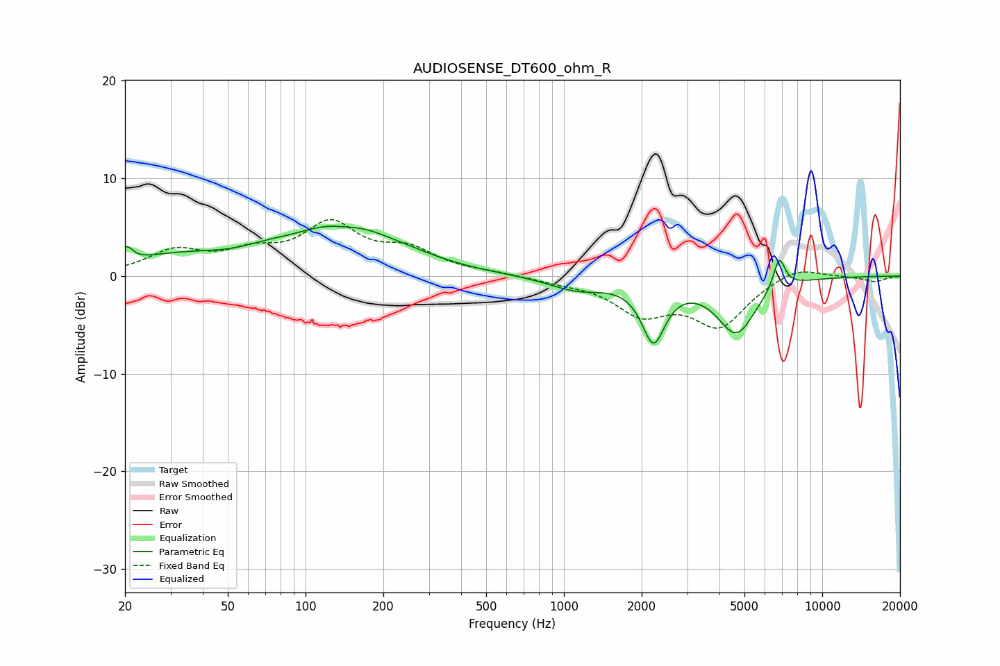

# AUDIOSENSE_DT600_ohm_R
See [usage instructions](https://github.com/jaakkopasanen/AutoEq#usage) for more options and info.

### Parametric EQs
Apply preamp of -5.2 dB when using parametric equalizer.

|   # | Type    |   Fc (Hz) |    Q |   Gain (dB) |
|-----|---------|-----------|------|-------------|
|   1 | Peaking |        20 | 5.91 |         1.5 |
|   2 | Peaking |        32 | 0.73 |         1.8 |
|   3 | Peaking |        70 | 1.52 |         0.6 |
|   4 | Peaking |       138 | 0.73 |         5.1 |
|   5 | Peaking |       141 | 2.13 |        -0.5 |
|   6 | Peaking |       256 | 0.99 |         0.4 |
|   7 | Peaking |      1122 | 1.25 |        -1.4 |
|   8 | Peaking |      2223 | 3.11 |        -6.1 |
|   9 | Peaking |      4651 | 1.85 |        -5.7 |
|  10 | Peaking |      6815 | 5.91 |         3.2 |

### Fixed Band EQs
When using fixed band (also called graphic) equalizer, apply preamp of **-5.9 dB** (if available) and set gains manually with these parameters.

|   # | Type    |   Fc (Hz) |    Q |   Gain (dB) |
|-----|---------|-----------|------|-------------|
|   1 | Peaking |        31 | 1.41 |         2.4 |
|   2 | Peaking |        62 | 1.41 |         1.9 |
|   3 | Peaking |       125 | 1.41 |         4.9 |
|   4 | Peaking |       250 | 1.41 |         2.3 |
|   5 | Peaking |       500 | 1.41 |         0.3 |
|   6 | Peaking |      1000 | 1.41 |        -0.5 |
|   7 | Peaking |      2000 | 1.41 |        -3.5 |
|   8 | Peaking |      4000 | 1.41 |        -4.9 |
|   9 | Peaking |      8000 | 1.41 |         1.2 |
|  10 | Peaking |     16000 | 1.41 |        -0.6 |

### Graphs

