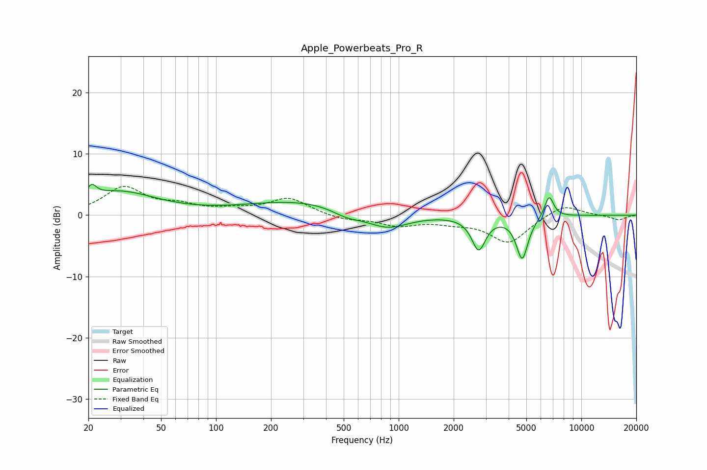

# Apple_Powerbeats_Pro_R
See [usage instructions](https://github.com/jaakkopasanen/AutoEq#usage) for more options and info.

### Parametric EQs
Apply preamp of -5.1 dB when using parametric equalizer.

|   # | Type    |   Fc (Hz) |    Q |   Gain (dB) |
|-----|---------|-----------|------|-------------|
|   1 | Peaking |        21 | 5.5  |         1.9 |
|   2 | Peaking |        29 | 0.68 |         3.8 |
|   3 | Peaking |       303 | 0.44 |         2.4 |
|   4 | Peaking |       519 | 1.67 |        -1.3 |
|   5 | Peaking |       863 | 1.18 |        -2.7 |
|   6 | Peaking |      1581 | 5.98 |         0   |
|   7 | Peaking |      2741 | 3.75 |        -5.4 |
|   8 | Peaking |      4746 | 4.26 |        -7   |
|   9 | Peaking |      6661 | 5.4  |         3.6 |
|  10 | Peaking |      9980 | 6    |         0   |

### Fixed Band EQs
When using fixed band (also called graphic) equalizer, apply preamp of **-4.8 dB** (if available) and set gains manually with these parameters.

|   # | Type    |   Fc (Hz) |    Q |   Gain (dB) |
|-----|---------|-----------|------|-------------|
|   1 | Peaking |        31 | 1.41 |         4.4 |
|   2 | Peaking |        62 | 1.41 |         1.3 |
|   3 | Peaking |       125 | 1.41 |         0.7 |
|   4 | Peaking |       250 | 1.41 |         2.7 |
|   5 | Peaking |       500 | 1.41 |        -0.8 |
|   6 | Peaking |      1000 | 1.41 |        -1.6 |
|   7 | Peaking |      2000 | 1.41 |        -0.9 |
|   8 | Peaking |      4000 | 1.41 |        -4.5 |
|   9 | Peaking |      8000 | 1.41 |         1.9 |
|  10 | Peaking |     16000 | 1.41 |        -0.8 |

### Graphs

