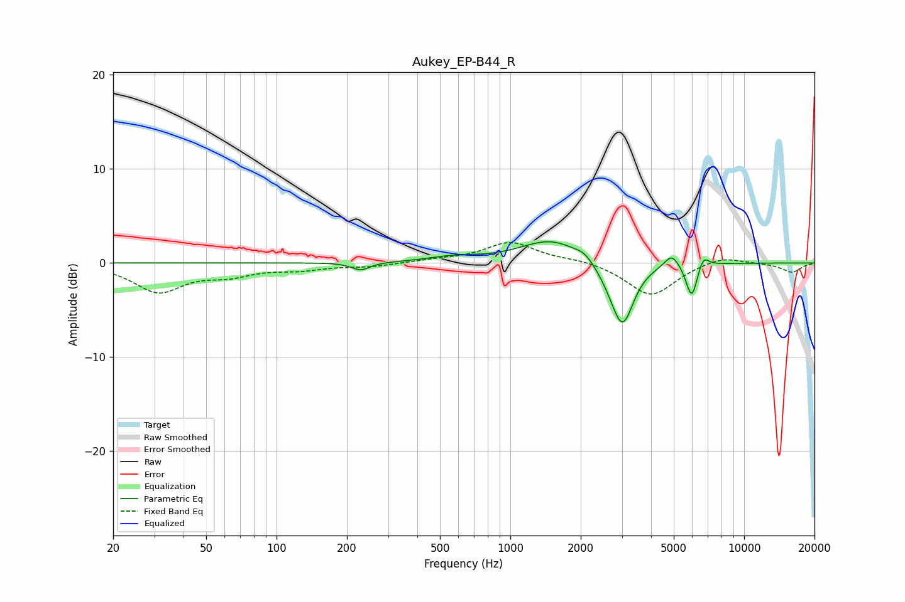

# Aukey_EP-B44_R
See [usage instructions](https://github.com/jaakkopasanen/AutoEq#usage) for more options and info.

### Parametric EQs
Apply preamp of -2.4 dB when using parametric equalizer.

|   # | Type    |   Fc (Hz) |    Q |   Gain (dB) |
|-----|---------|-----------|------|-------------|
|   1 | Peaking |       229 | 3.59 |        -0.8 |
|   2 | Peaking |       567 | 1.34 |         0.5 |
|   3 | Peaking |      1502 | 1.07 |         2.5 |
|   4 | Peaking |      2084 | 3.66 |         0.6 |
|   5 | Peaking |      2740 | 2.34 |        -1.2 |
|   6 | Peaking |      3027 | 3    |        -6.1 |
|   7 | Peaking |      4907 | 4.46 |         1.4 |
|   8 | Peaking |      5834 | 5.63 |        -0.8 |
|   9 | Peaking |      5996 | 6    |        -3   |
|  10 | Peaking |      6695 | 6    |         1.3 |

### Fixed Band EQs
When using fixed band (also called graphic) equalizer, apply preamp of **-2.3 dB** (if available) and set gains manually with these parameters.

|   # | Type    |   Fc (Hz) |    Q |   Gain (dB) |
|-----|---------|-----------|------|-------------|
|   1 | Peaking |        31 | 1.41 |        -3   |
|   2 | Peaking |        62 | 1.41 |        -1.1 |
|   3 | Peaking |       125 | 1.41 |        -0.6 |
|   4 | Peaking |       250 | 1.41 |        -0.4 |
|   5 | Peaking |       500 | 1.41 |         0.3 |
|   6 | Peaking |      1000 | 1.41 |         2.2 |
|   7 | Peaking |      2000 | 1.41 |         0.4 |
|   8 | Peaking |      4000 | 1.41 |        -3.5 |
|   9 | Peaking |      8000 | 1.41 |         0.8 |
|  10 | Peaking |     16000 | 1.41 |        -1   |

### Graphs

