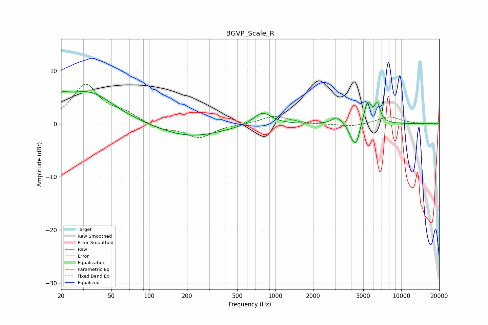

# BGVP_Scale_R
See [usage instructions](https://github.com/jaakkopasanen/AutoEq#usage) for more options and info.

### Parametric EQs
Apply preamp of -6.2 dB when using parametric equalizer.

|   # | Type    |   Fc (Hz) |    Q |   Gain (dB) |
|-----|---------|-----------|------|-------------|
|   1 | Peaking |        20 | 5.97 |         0.4 |
|   2 | Peaking |        20 | 1.96 |         2   |
|   3 | Peaking |        33 | 0.72 |         5.8 |
|   4 | Peaking |       211 | 0.56 |        -2.5 |
|   5 | Peaking |       792 | 1.99 |         2.5 |
|   6 | Peaking |      3080 | 3.91 |         1.3 |
|   7 | Peaking |      4042 | 5.27 |        -1.5 |
|   8 | Peaking |      4405 | 4.86 |        -3.8 |
|   9 | Peaking |      5404 | 4.53 |         4.2 |
|  10 | Peaking |      6465 | 5.92 |         3.2 |

### Fixed Band EQs
When using fixed band (also called graphic) equalizer, apply preamp of **-7.5 dB** (if available) and set gains manually with these parameters.

|   # | Type    |   Fc (Hz) |    Q |   Gain (dB) |
|-----|---------|-----------|------|-------------|
|   1 | Peaking |        31 | 1.41 |         7.2 |
|   2 | Peaking |        62 | 1.41 |         1.7 |
|   3 | Peaking |       125 | 1.41 |        -1   |
|   4 | Peaking |       250 | 1.41 |        -2.6 |
|   5 | Peaking |       500 | 1.41 |        -0.1 |
|   6 | Peaking |      1000 | 1.41 |         1.5 |
|   7 | Peaking |      2000 | 1.41 |        -0.1 |
|   8 | Peaking |      4000 | 1.41 |        -0.6 |
|   9 | Peaking |      8000 | 1.41 |         1.4 |
|  10 | Peaking |     16000 | 1.41 |        -0   |

### Graphs

