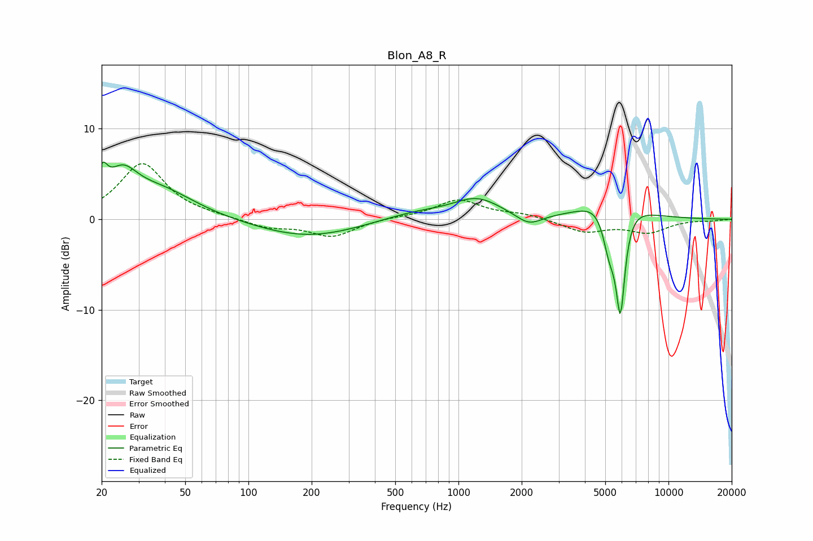

# Blon_A8_R
See [usage instructions](https://github.com/jaakkopasanen/AutoEq#usage) for more options and info.

### Parametric EQs
Apply preamp of -6.4 dB when using parametric equalizer.

|   # | Type    |   Fc (Hz) |    Q |   Gain (dB) |
|-----|---------|-----------|------|-------------|
|   1 | Peaking |        20 | 5.95 |         2.8 |
|   2 | Peaking |        25 | 1.97 |         3.7 |
|   3 | Peaking |        38 | 0.83 |         3.1 |
|   4 | Peaking |       191 | 0.57 |        -2   |
|   5 | Peaking |       620 | 0.84 |         0.9 |
|   6 | Peaking |      1228 | 1.24 |         2.2 |
|   7 | Peaking |      2167 | 2.29 |        -1.3 |
|   8 | Peaking |      5233 | 3.96 |        -5.5 |
|   9 | Peaking |      5373 | 1.4  |         4.1 |
|  10 | Peaking |      5906 | 6    |       -11.7 |

### Fixed Band EQs
When using fixed band (also called graphic) equalizer, apply preamp of **-6.2 dB** (if available) and set gains manually with these parameters.

|   # | Type    |   Fc (Hz) |    Q |   Gain (dB) |
|-----|---------|-----------|------|-------------|
|   1 | Peaking |        31 | 1.41 |         6.1 |
|   2 | Peaking |        62 | 1.41 |         0.2 |
|   3 | Peaking |       125 | 1.41 |        -0.9 |
|   4 | Peaking |       250 | 1.41 |        -1.9 |
|   5 | Peaking |       500 | 1.41 |         0.2 |
|   6 | Peaking |      1000 | 1.41 |         2.1 |
|   7 | Peaking |      2000 | 1.41 |         0.5 |
|   8 | Peaking |      4000 | 1.41 |        -1.4 |
|   9 | Peaking |      8000 | 1.41 |        -1.4 |
|  10 | Peaking |     16000 | 1.41 |        -0.1 |

### Graphs

