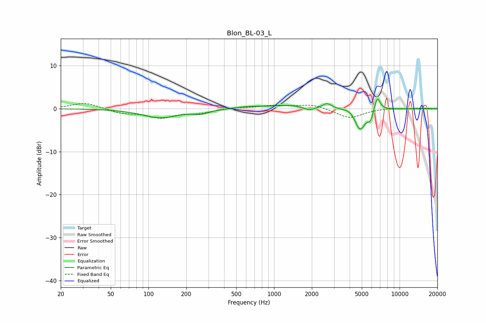

# Blon_BL-03_L
See [usage instructions](https://github.com/jaakkopasanen/AutoEq#usage) for more options and info.

### Parametric EQs
Apply preamp of -2.3 dB when using parametric equalizer.

|   # | Type    |   Fc (Hz) |    Q |   Gain (dB) |
|-----|---------|-----------|------|-------------|
|   1 | Peaking |       124 | 1    |        -2.1 |
|   2 | Peaking |       263 | 2.31 |        -0.8 |
|   3 | Peaking |       634 | 1.36 |         0.4 |
|   4 | Peaking |      1433 | 0.87 |         0.9 |
|   5 | Peaking |      1897 | 2.87 |        -1   |
|   6 | Peaking |      2644 | 4.04 |         1.2 |
|   7 | Peaking |      4040 | 3.41 |         0.6 |
|   8 | Peaking |      4837 | 3.34 |        -5   |
|   9 | Peaking |      5865 | 6    |        -2.2 |
|  10 | Peaking |      6636 | 5.65 |         3.4 |

### Fixed Band EQs
When using fixed band (also called graphic) equalizer, apply preamp of **-1.3 dB** (if available) and set gains manually with these parameters.

|   # | Type    |   Fc (Hz) |    Q |   Gain (dB) |
|-----|---------|-----------|------|-------------|
|   1 | Peaking |        31 | 1.41 |         1.4 |
|   2 | Peaking |        62 | 1.41 |        -1   |
|   3 | Peaking |       125 | 1.41 |        -2   |
|   4 | Peaking |       250 | 1.41 |        -0.9 |
|   5 | Peaking |       500 | 1.41 |         0.3 |
|   6 | Peaking |      1000 | 1.41 |         0.7 |
|   7 | Peaking |      2000 | 1.41 |         1   |
|   8 | Peaking |      4000 | 1.41 |        -2.2 |
|   9 | Peaking |      8000 | 1.41 |         0.2 |
|  10 | Peaking |     16000 | 1.41 |         0.1 |

### Graphs

