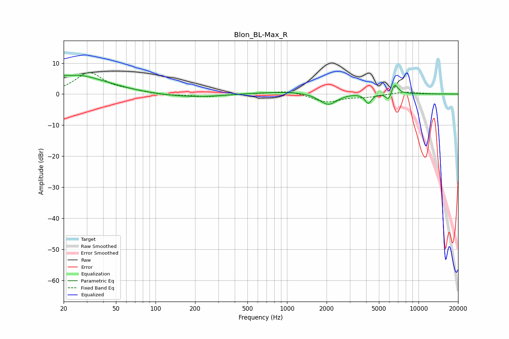

# Blon_BL-Max_R
See [usage instructions](https://github.com/jaakkopasanen/AutoEq#usage) for more options and info.

### Parametric EQs
Apply preamp of -6.2 dB when using parametric equalizer.

|   # | Type    |   Fc (Hz) |    Q |   Gain (dB) |
|-----|---------|-----------|------|-------------|
|   1 | Peaking |        20 | 1.24 |         1.6 |
|   2 | Peaking |        23 | 5.83 |         3.2 |
|   3 | Peaking |        23 | 5.76 |        -3.5 |
|   4 | Peaking |        27 | 0.59 |         5.1 |
|   5 | Peaking |       195 | 0.52 |        -1.2 |
|   6 | Peaking |      1331 | 0.32 |         1   |
|   7 | Peaking |      2059 | 2    |        -4.1 |
|   8 | Peaking |      4150 | 5.71 |        -3.2 |
|   9 | Peaking |      5945 | 6    |        -2.9 |
|  10 | Peaking |      6553 | 5.15 |         3.7 |

### Fixed Band EQs
When using fixed band (also called graphic) equalizer, apply preamp of **-7.0 dB** (if available) and set gains manually with these parameters.

|   # | Type    |   Fc (Hz) |    Q |   Gain (dB) |
|-----|---------|-----------|------|-------------|
|   1 | Peaking |        31 | 1.41 |         6.8 |
|   2 | Peaking |        62 | 1.41 |         0.8 |
|   3 | Peaking |       125 | 1.41 |        -0.5 |
|   4 | Peaking |       250 | 1.41 |        -0.8 |
|   5 | Peaking |       500 | 1.41 |         0.1 |
|   6 | Peaking |      1000 | 1.41 |         1.2 |
|   7 | Peaking |      2000 | 1.41 |        -2.6 |
|   8 | Peaking |      4000 | 1.41 |        -0.8 |
|   9 | Peaking |      8000 | 1.41 |         0.8 |
|  10 | Peaking |     16000 | 1.41 |         0   |

### Graphs

